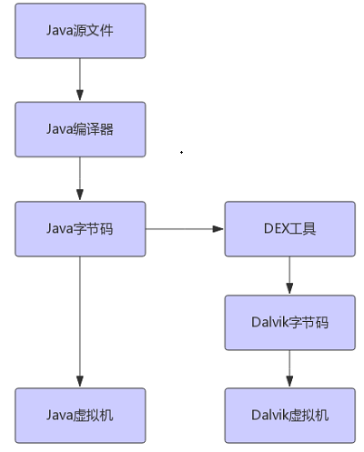
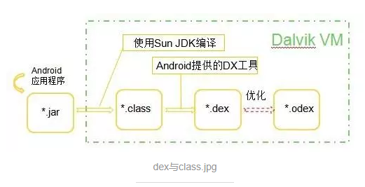

# DVM
Dalvik是Google公司自己设计用于Android平台的Java虚拟机，是Android中java程序运行的基础。

其指令集是**基于寄存器架构**，执行其特有的文件格式————**dex字节**来完成对象生命周期的管、堆栈的管理、线程的管理、安全异常的管理、垃圾回收等功能。它的核心内容是**实现库（libdvm.so）**,大体由C语言实现。

## DVM和JVM的区别与联系
### Dalvik VM是基于寄存器架构（reg based）,而JVM是堆栈结构（stack based）。

*这里的寄存器架构和堆栈结构指的是计算机指令系统，计算机指令系统分为四种：堆栈型，累加器型，寄存器-储存器型和寄存器-寄存器型。四种分类的依据是操作数的来源。堆栈型默认的操作数都在栈顶，累加器型默认一个操作数是累加器，寄存器-存储器型的操作数可以是寄存器或者内存。寄存器-寄存器型除了访存指令，操作数都是寄存器。*

- dvm速度快！寄存器存取速度比栈快得多，dvm可以根据硬件实现最大的优化，比较适合移动设备。Java虚拟机基于栈结构，程序在运行时虚拟机需要频繁的从栈上读取写入数据，这个过程需要更多的指令分派与内存访问次数，会耗费很多CPU时间。

- 指令数小！dvm基于寄存器，所以它的指令是二地址和三地址混合，指令中指明了操作数的地址；jvm基于栈实现，它的指令是零指令，指令的操作数对象默认是操作数栈中的几个位置。这样带来的结果就是dvm的指令数相对于jvm的指令数会小很多，jvm需要多条指令而dvm可能只需要一条指令。

### Dalvik 执行速度比 JVM 快，但移植性稍差

在一个解释器上执行VM指令，包含三个步骤：指令分派、访问操作数和执行计算。

- 指令分配

指令分配负责从内存中读取VM指令，然后跳转到相应的解释器代码中。基于栈的虚拟机需要更多的指令，更多的指令分派和内存访问次数，这是JVM的执行性能不如 Dalvik VM 的原因之一。

- 访问操作数

访问操作数是指读取和写回源操作数和目的操作数。Dalvik VM通过虚拟寄存器来访问操作数，Dalvik的虚拟寄存器在映射到物理寄存器方面具有更充分的优势，这也是Dalvik VM性能较佳的一个原因。

JVM的操作数通过操作数栈来访问，而因为指令中没有使用任何通过寄存器，在虚拟机的实现中可以比较自由的分配实际机器的寄存器，因而可移植性高。

- 指令执行

### Dalvik执行的是特有的DEX文件格式，而JVM运行的是.class文件格式

在Java程序中，Java类会被编译成一个或多个class文件，然后打包到jar文件中，接着Java虚拟机会从相应的class文件和jar文件中获取对应的字节码；Android应用虽然也使用Java语言，但是在编译成class文件后，**还会通过DEX工具将所有的class文件转换成一个dex文件，Dalvik虚拟机再从中读取指令和数据。**

优势：

class文件去冗余：class文件存在很多的冗余信息，dex工具会去除冗余信息（多个class中的字符串常量合并为一个，比如对于java/lang/Object字符常量，每个class文件基本都有该字符常量，存在很大的冗余)，并把所有的.class文件整合到.dex文件中。减少了I/O操作，提高了类的查找速度。）

缺点：

方法数受限：多个class文件变成一个dex文件所带来的问题就是方法数超过**65535**时报错，由此引出MultiDex技术。

最终生成了一个.odex文件，odex是为了在运行过程中进一步提高性能，对dex文件的进一步优化，优化后的文件大小会有所增加，应该是原DEX文件的1-4倍。

### Dalvik可以允许多个instance 运行，也就是说每一个Android 的App是独立跑在一个VM中

一个应用，一个进程，一个Dalvik！

Zygote是一个虚拟机进程，同时也是一个虚拟机实例的孵化器，它通过init进程启动。首先会孵化出System_Server，他是android绝大多系统服务的守护进程，它会监听socket等待请求命令，当有一个应用程序启动时，就会向它发出请求，zygote就会FORK出一个新的应用程序进程。

**Zygote进程是在系统启动时产生的，它会完成虚拟机的初始化，库的加载，预置类库的加载和初始化等等操作**，而在系统需要一个新的虚拟机实例时，**Zygote通过复制自身，最快速的提供个进程；**另外，对于一些只读的系统库，所有虚拟机实例都和Zygote共享一块内存区域，大大节省了内存开销。

**每一个app启动的时候，就会有自己的进程与Dalvik虚拟机实例。而这样做的好处是一个App crash只会影响到自身的VM，不会影响到其他。**Dalvik的设计是每一个Dalvik的VM都是Linux下面的一个进程。

