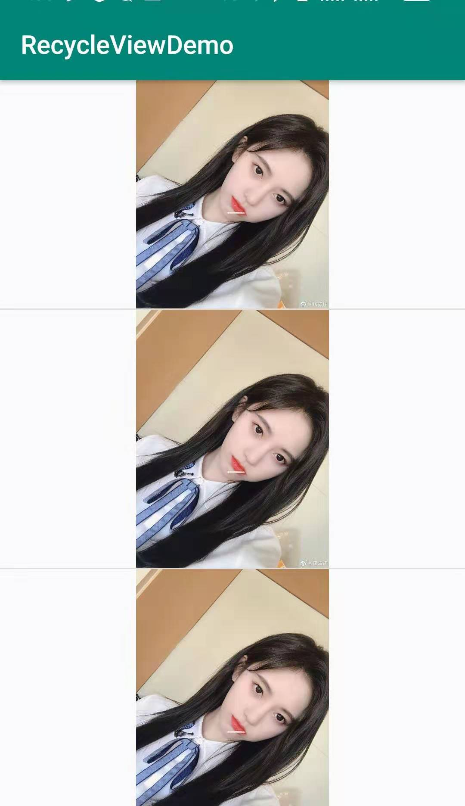
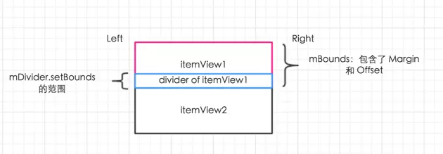

# ItemDecoration
通过ItemDecoration，可以给RecyclerView或者RecyclerView中的每个Item添加额外的装饰效果，最常用的就是用来为Item之间添加分割线。

# API介绍
当我们实现自己的ItemDecoration时，需要继承于ItemDecoration，并根据需要实现以下三个方法：

## public void onDraw(Canvas c, RecyclerView parent, State state)
- canvas：RecyclerView的canvas
- parent：RecyclerView实例
- State：RecyclerView当前的状态，值包括START/LAYOUT/ANIMATION。

所有在这个方法中的绘制操作，将会在itemViews被绘制之前执行，因此，它会显示在itemView之下。

## public void onDrawOver(Canvas c, RecyclerView parent, State state)
和上述方法类似，区别在于它绘制在itemViews之上。

## public void getItemOffsets(Rect outRect, View view, RecyclerView parent, State state)
通过outRect，可以设置item之间的间隔，间隔区域的大小就是outRect所指定的范围，view就是对应位置的itemView，其它的参数解释和上面相同。

# DividerItemDecoration解析
官方自带的DividerItemDecoration,DividerItemDecoration是为LinearLayoutManager提供的分割线，在创建它的时候，需要指定ORIENTATION，这个方向应当和LinearLayoutManager的方向相同。
```java
    LinearLayoutManager manager=new LinearLayoutManager(this,RecyclerView.VERTICAL,false);
    recyclerView.addItemDecoration(new DividerItemDecoration(this,RecyclerView.VERTICAL));
    recyclerView.setLayoutManager(manager);
    recyclerView.setAdapter(normalAdapter); 
```
运行结果：


# 源码分析
## 绘制
DividerItemDecoration重写了基类当中的onDraw方法，也就是说这个分割线是在itemView之前绘制的：
```java
public void onDraw(Canvas c, RecyclerView parent, RecyclerView.State state {
    if (parent.getLayoutManager() == null || mDivider == null) {
        return;
    }
    if (mOrientation == VERTICAL) {
        drawVertical(c, parent);
    } else {
        drawHorizontal(c, parent);
    }
}
```
纵向排列的RecyclerView分割线：
```java
@SuppressLint("NewApi")
private void drawVertical(Canvas canvas, RecyclerView parent) {
    //首先保存画布
    canvas.save();
    final int left;
    final int right;
    //确定左右边界的范围，如果RecyclerView不允许子View绘制在Padding内，那么这个范围为去掉Padding后的范围
    if (parent.getClipToPadding()) {
        left = parent.getPaddingLeft();
        right = parent.getWidth() - parent.getPaddingRight();
        canvas.clipRect(left, parent.getPaddingTop(), right,
                parent.getHeight() - parent.getPaddingBottom());
    } else {
        left = 0;
        right = parent.getWidth();
    }
    final int childCount = parent.getChildCount();
    for (int i = 0; i < childCount; i++) {
        final View child = parent.getChildAt(i);
        //获得itemView的范围，这个范围包括了margin和offset，它们被保存在mBounds当中
        parent.getDecoratedBoundsWithMargins(child, mBounds);
        //需要考虑translationY和translationY
        final int bottom = mBounds.bottom + Math.round(ViewCompat.getTranslationY(child));
        //由于是垂直排列的，因此上边界等于下边界减去分割线的高度.
        final int top = bottom - mDivider.getIntrinsicHeight();
        //设置divider和范围
        mDivider.setBounds(left, top, right, bottom);
        //绘制.
        mDivider.draw(canvas);
    }
    //恢复画布.
    canvas.restore();
}
```
整个过程分为三步：

- 确定子View在RecyclerView中的绘制范围
- 确定每个子View的范围
- 确定mDivider的绘制范围



横向排列的RecyclerView列表和上面的原理是相同的，区别就在于计算mDivider.setBounds的计算：
```java
//....
parent.getLayoutManager().getDecoratedBoundsWithMargins(child, mBounds);
final int right = mBounds.right + Math.round(ViewCompat.getTranslationX(child));
final int left = right - mDivider.getIntrinsicWidth();
mDivider.setBounds(left, top, right, bottom);
//..
```

## 边界处理
从上面的分析可以知道，如果将divider直接绘制在itemView的范围内，那么由于我们是先绘制divider，再绘制itemView的内容的，那么它就会被覆盖，因此，通过重写getItemOffsets，通过其中的outRect来指定留出的空隙：
```java
@Override
public void getItemOffsets(Rect outRect, View view, RecyclerView parent,
        RecyclerView.State state) {
    if (mDivider == null) {
        outRect.set(0, 0, 0, 0);
        return;
    }
    if (mOrientation == VERTICAL) {
        //如果是纵向排列，那么要在itemView的下方留出一个下边界
        outRect.set(0, 0, 0, mDivider.getIntrinsicHeight());
    } else {
        //如果是横向排列，那么要在itemView的右方留出一个右边界
        outRect.set(0, 0, mDivider.getIntrinsicWidth(), 0);
    }
}
```
