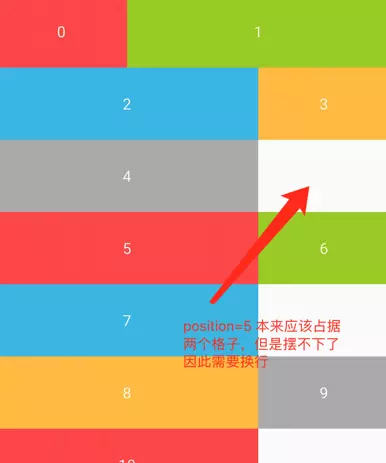
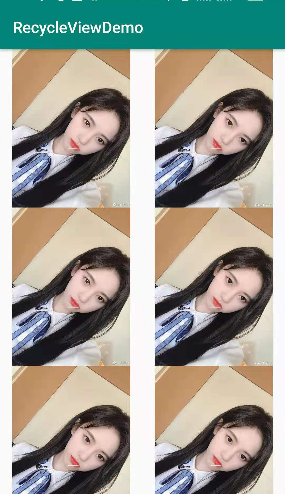
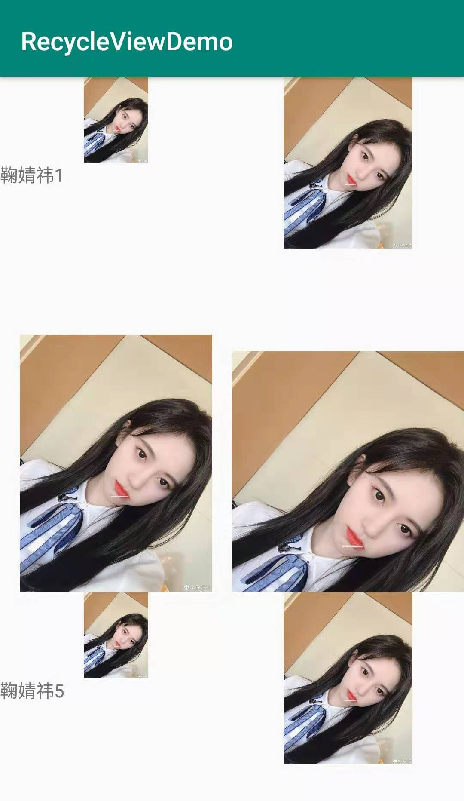

# LayoutManager
在整个RecyclerView的体系当中，Adapter负责提供View，而LayoutManager负责决定它们在RecyclerView中摆放的位置以及在窗口中不可见之后的回收策略。

# LayoutManager的使用
通过重写LayoutManager，我们可以得到各式各样的布局。官方提供了以下三种LayoutManager：
- LinearLayoutManager
- GridLayoutManager
- StaggeredGridLayoutManager

## 线性布局：LinearLayoutManager
使用这个LinearLayoutManager时，所有的Item都是线性排列的，我们可以指定以下两点。

###  纵向/横向排列:
- 纵向排列：LinearLayoutManager.OrientationHelper.VERTICAL

- 横向排列：LinearLayoutManager.OrientationHelper.HORIZONTAL

```JAVA
    LinearLayoutManager manager=new LinearLayoutManager(this);
    manager.setOrientation(LinearLayoutManager.HORIZONTAL);
    recyclerView.setLayoutManager(manager);
```

### Item排列的顺序和滑动方向
通过reverse指定Items排列的顺序：
- true：从右向左或从下到上排列，也就是position=0的Item位于最右边或最下面，往左或者往上滑动得到下一个Item。

- false：和上面相反，也就是我们常见的模式。

```java
LinearLayoutManager manager=new LinearLayoutManager(this);
manager.setReverseLayout(true);
```

## 宫格布局：GridLayoutManager
### 指定某行或某一列的个数
通过spanCount参数指定，相当于把RecyclerView的每行或者每列均分为spanCount个格子，每个Item可以占据一个或者多个格子，默认情况下每个Item占据一个格子，也就是均分。

### 纵向/横向排列
- 纵向排列：先填满一行，再从下一行开始填充。
- 横向排列：先填满一列，在从下一列开始填充。

### reverse参数
指定了Items排列的顺序：
- reverse=true：逆序排列所有的Item，和2.1.2的排列方式有关，如果是纵向排列，那么position=0的Item位于左下角，如果是横向排列，那么位于右上角。
- reverse=false：position=0的Item位于左上角。

### 指定分配的比例
spanCount指定的是分配的格子数，默认情况下每个Item会占据一个格子，如果想要改变每一行或者每一列Item分配的比例，那么可以指定它们占据的格子数，如果该行或者该列剩余的格子不够分配了，那么就换行，但是一定不能够大于spanCount的值：
```java
public void setSpanSizeLookup(SpanSizeLookup spanSizeLookup) {
    mSpanSizeLookup = spanSizeLookup;
}
```

**EX:**
```JAVA
GridLayoutManager manager=new GridLayoutManager(this,3RecyclerView.VERTICAL,false);
manager.setSpanSizeLookup(new GridLayoutManager.SpanSizeLookup() {
    @Override
    public int getSpanSize(int position) {
        return position % 3 == 0 ? 1 : 2;
    }
});
```
结果：


## 瀑布流：StaggeredGridLayoutManager
### 指定spanCount
和宫格布局类似，可以指定每行或者每列划分的格子数，但是它不支持让某个Item占据多个格子。

### 横向或者纵向排列
这个和上面两个LayoutManager的原理类似，就不解释了。

### 实现
默认情况下，如果我们只生成一个StaggeredGridLayoutManager，那么效果会是下面这样：


因此，我们要**在onBindViewHolder中动态地改变每个itemView的高度**，这样才可以达到瀑布流的效果：
```java
public void onBindViewHolder(@NonNull NormalViewHolder holder, intposition) {
    ·
    ·
    ·
    ViewGroup.LayoutParams layoutParams=holder.imageView.getLayoutParams();
    layoutParams.height=200 + (position % 4) * 200;
    holder.imageView.setLayoutParams(layoutParams);
}
```

