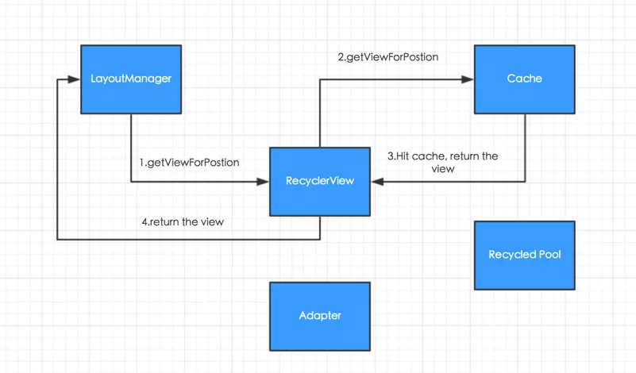

# RecyclerView架构

整个RecyclerView体系包含三大组件：

- LayoutManager：position the view

- ItemAnimator：animate the view

- Adapter：provide the view

这三大组件各司其职，而RecyclerView负责管理，就组成了整个RecyclerView的架构。

## LayoutManager
LayoutManager需要负责以下几部分的工作：
- **Position**  
它负责View的摆放，可以是线性、宫格、瀑布流式或者任意类型，而RecyclerView不知道也不关心这些，这是LayoutManager的职责。

- **Scroll**  
对于滚动事件的处理，RecyclerView负责接收事件，但是最终还是由LayoutManager进行处理滚动后的逻辑，因为只有它在知道View具体摆放的位置。

- **Focus traversal**  
当焦点转移导致需要一个新的Item出现在可视区域中时，也是由LayoutManager处理的。

## Adapter
Adapter需要负责以下几部分的工作：
- 创建View和ViewHolder，后者作为整个复用机制的跟踪单元。
- 把具体位置的Item和ViewHolder进行绑定，并存储相关的信息。
- 通知RecyclerView数据变化，支持局部的更新，在提高效率的同时也有效地支持了动画。
- Item点击事件的处理。
- 多类型布局的支持。

# ViewHolder的生命周期
## LayoutManager请求RecyclerView提供指定position的View
ViewHolder是和View相绑定的，同时它也是整个复用框架的跟踪单元。在RecyclerView体系中，对ViewHolder采用了二级缓存，分为Cache和Recycled Pool，当LayoutManager向RecyclerView请求位于某个Position的View时，Recycled View会先去Cache中寻找，如果找到，那么直接返回；如果找不到，那么再去Recycled Pool中寻找，下面就是整个寻找过程的几种情况：

- **命中Cache**  
这种情况下，不会调用Adapter的onCreateViewHolder或者onBindViewHolder方法：

- **Cache不存在，Recycled Pool也不存在**  
这种情况下，会调用Adapter的onCreateViewHolder方法，让它提供一个对应viewType的ViewHolder，我们在其中建立ViewHolder和View之间的关联。

- **Cache不存在，Recycled Pool存在**  
这种情况下，会回调Adapter的onBindViewHolder方法，我们在其中使用当前的数据集合来更新ViewHolder所绑定的itemView的状态。

## LayoutManager找到对应位置的View
LayoutManager通过addView方法把之前找到的View添加进RecyclerView，RecyclerView通过onViewAttachToWindow(VH viewHolder)方法，通知Adapter这个viewHolder所关联的itemView已经被添加到了布局当中。

## LayoutManager请求RecyclerView移除某一个位置的View
### 普通情况
当LayoutManager发现不再需要某一个position的View时，它会通知RecyclerView，RecyclerView通过onViewDetachFromWindow(VH viewHolder)通知Adapter和它绑定的itemView被移出了。同时，RecyclerView判断它是否能够被缓存，假设能够被缓存，那么它会先被放到Cache当中，在Cache中又会判断它内部是否有需要转移到Recycled Pool中的ViewHolder，在放入之后回收池后，通过onViewRecycled(VH viewHolder)方法通知Adapter它被回收了。

### 特殊情况
在上面的普通的情况中，onViewDetachFromWindow(VH viewHolder)是立即被回调的。然而在实际当中，由于我们需要对View的添加、删除做一些过度动画，这时候，我们需要等待ItemAnimator进行完动画操作之后，才做detach和recycle的逻辑，这一过程对于LayoutManager是不可见的。

## ViewHolder的销毁
在一般情况下，我们不会去销毁ViewHolder，而是把它放入到缓存当中，除非出现以下两种情况。

### ViewHolder所绑定的itemView当前状态异常
在放入Recycled Pool时，会去检查itemView的状态是否正常。这一操作的目的主要是为了避免出现诸如此类的情况：当前itemView正在执行动画，此时它可能呈现半透明的状态，如果此时把它放入到回收池中，那么当另一个位置的position需要复用它时就可能会出现问题。
当出现上面的情况后，Recycled Pool会先通过Adapter的onFailedToRecycled(VH viewHolder)告诉它我们现在出现了异常的情况，由Adapter的实现者通过返回值来决定是否仍然要把它放入到Recycled Pool，默认是返回false，也就是不放入，那么这个ViewHolder就会被销毁了。

### Recycled Pool中已经没有足够的空间
Recycled Pool的空间并不是无限大的，因此，如果没有足够的空间存放要被回收的ViewHolder，那么它也会被销毁。

造成这种情况的一般是动画引起的，例如，我们调用了notifyItemRangeChanged(0, getItemCount())方法，这时候为了进行渐出渐进的动画，那么我们就需要创建两倍的ViewHolder，出现这种情况时一般有两种解决方法：

- 只通知具体发生变化的Item

- 通过pool.setMaxRecycledViews(type, count)改变回收池的大小。

# ItemAnimator
对于Item的动画，主要有以下几种情况：
- 添加：Fade In
- 删除：Fade Out
- 移动：Translate
- 更新：Cross Fade

RecyclerView对于动画的处理采用了Predictive的方式，除了当前已经在RecyclerView布局中的View（实线框部分），它还需要知道在屏幕意外的信息（虚线框部分），这样在H被删除的时候，它才能够对J-K进行上移动画，并把原来不在屏幕内的L上移到可视范围之内。

# ChildHelper和AdapterHelper
## ChildHelper
对于ChildHelper的作用是：Provide a virtual children list to layoutmanager，下面我们就首先看一下为什么需要它。

### 解决什么问题
我们看下面这种情况，假如LayoutManager想要移除一个View，而ItemAnimator又希望给这一移除的操作增加一个动画，那么这时候就会产生冲突，到底应该怎么办，为此，RecyclerView通过ChildHelper来把它们隔离开。

### 解决问题的方法
当RecyclerView收到LayoutManager要求改变布局的请求时，它并不是直接去更改ViewGroup，而是让ChildHelper和ItemAnimator去协调，并由它来操作ViewGroup。

## AdapterHelper
而AdapterHelper所解决的问题和ChildHelper类似，ChildHelper是处理View的，而AdapterHelper用来跟踪ViewHolder的，其作用为：
- Tracks ViewHolder positions(跟踪ViewHolder位置)
- Virtual Adapter for LayoutManager(对应LayoutManager虚拟适配器)

说起来可能比较抽象，我们用下面这种图理解一下，当我们移动某个Item并且它的onLayout方法还没有完成，那么Adapter和Layout的postion是不相同的：

# ItemDecoration
ItemDecoration用来在RecyclerView的Canvas上进行额外的绘制操作，我们不仅可以在单个Item（例如给每个Item添加分割线）的Canvas上进行绘制，也可以在整个RecyclerView的Canvas上进行绘制，此外，我们还可以指定Item之间的间隔：

- Custom Drawing on RecyclerViews Canvas(在RecyclerViews画布上自定义绘画)
- Add offset to View bounds(添加view边界的偏移量)
- Have multiple ItemDecoration(拥有多重item装饰)

需要注意的点：
- Do not try to access to adapter(不要尝试访问适配器)
- Keep necessary information in viewHolder(在viewHolder中保存必要的信息)
- General onDraw rules apply(适用一般的onDraw规则)
- recyclerView.getChildViewHolder(View view)

# RecycledViewPool
RecyclerViewPool用来缓存那些回收的View，这些缓存不仅可以提供给单个RecyclerView使用，还可以提供和别的自定义控件共享。

# ItemTouchHelper
之前使用ListView的时候，如果需要支持侧滑删除、拖动排序这种操作，那么我们一般用引入一些开源库，现在RecyclerView已经帮我们提供了实现的接口，通过重写ItemTouchHelper的方法，就可以实现上面提到的那些操作。

