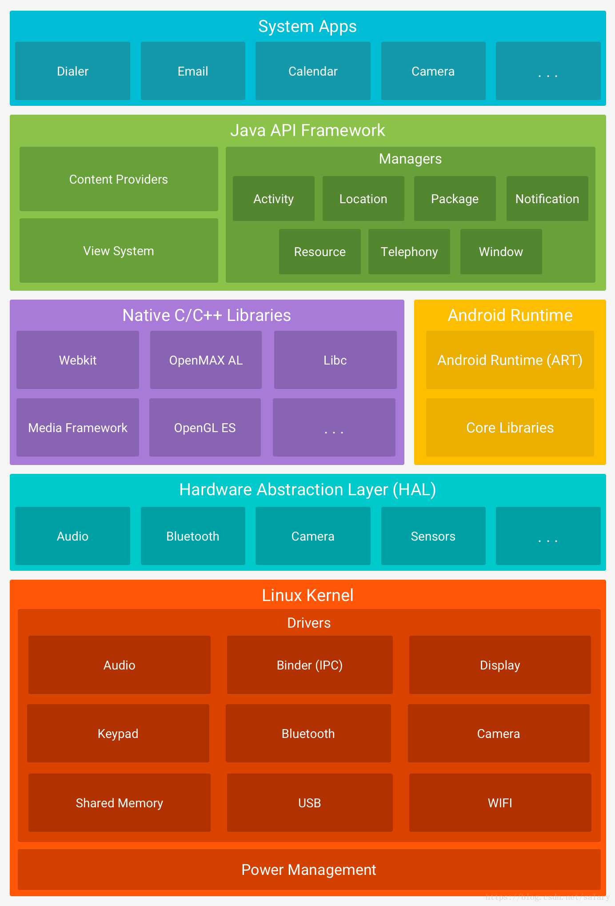

# Android架构图

# Linux内核

Android是基于Linux内核的（Linux内核提供了安全性、内存管理、进程管理、网络协议和驱动模型等核心系统服务），Linux内核层为各种硬件提供了驱动程序，如显示驱动、相机驱动、蓝牙驱动、电池管理等等。

# 硬件抽象层（Hardware Abstraction Layer）

Android的硬件抽象层，简单来说，就是对Linux内核驱动程序的封装，向上提供接口，屏蔽底层的实现细节。HAL可以定义一个标准接口以供供应商实现，可让android忽略较低级别的驱动程序实现。

# Android系统运行层

包括Android Runtime 和 Native C/C++ Libaries(原生态的C/C++库)。

通过C或者C++库为Android系统提供主要的特性支持，例如Surface Manager管理访问显示子系统和从多模块应用中无缝整合2D和3D的图形，WebKit提供了浏览器支持等。可以使用 Android NDK 直接从访问某些原生态库。

Android运行时，其中包括了ART虚拟机（**Android 5.0之前是Dalvik虚拟机，ART模式与Dalvik模式最大的不同在于，在启用ART模式后，系统在安装应用的时候会进行一次预编译，在安装应用程序时会先将代码转换为机器语言存储在本地，这样在运行程序时就不会每次都进行一次编译了，执行效率也大大提升。如果您的应用在 ART 上运行效果很好，那么它应该也可在 Dalvik 上运行，但反过来不一定。**），每个Java程序都运行在ART虚拟机上，该虚拟机专门针对移动设备进行了定制，**每个应用都有其自己的 Android Runtime (ART) 实例**。此外，Android运行时还包含一套核心运行时库，可提供 Java API 框架使用的 Java 编程语言大部分功能，包括一些 Java 8 语言功能。

# Java API框架层

主要提供构建应用程序时可能用到的各种API，开发者通过这一层的API构建自己的APP。

# 系统应用层

所有安装在手机上的系统应用都属于这一层，自己开发的应用也属于这一层。