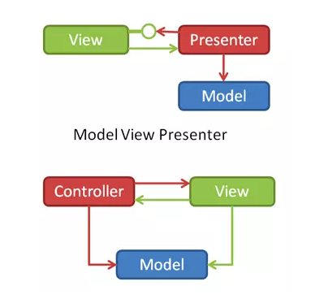
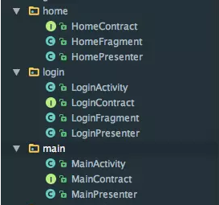
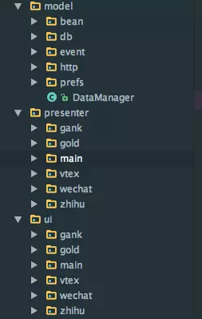

# MVP架构

## View,Presenter,Model

Model的工作就是完成对数据的操纵，数据的获取、存储、数据状态变化都是model层的任务，如网络请求，持久化数据的增删改查等任务。

View：只处理视图相关，不做任何逻辑处理，如Activity/Fragment

Presenter:作为桥梁，巧妙的将View和Model的具体实现连接起来。

**Presenter会根据需要调用model层的数据，处理逻辑并在需要时将回调传入.View层。**

## MVC和MVP

**MVP与MVC的区别：View能否直接操作Model**

## 项目目录
- 根据功能进行分模块 google的demo中就是按照这种方式划分的



- 可以按照model，view，presenter这种情况进行划分组织目录，然后再按功能划分



*MVP不是没有缺点的，在使用mvp的过程中，会多出很多类，每一个View（Activity或Fragment）都至少需要各自的Presenter和View接口，在加上他们各自的实现，不算model至少也要4个java文件，这样一个稍有点规模的APP，类就会变得异常的多，而每一个类的加载又会消耗资源；因此，相较于MVC，这算是MVP最大的缺点了吧。*

*如何使用泛型和抽象优化MVP 的结构就变成了我们用好MVP的关键了。当然，对于这个问题我们可以通过泛型参数、抽象父类的方式，将一些公用的Model及Presenter抽象出来。这应该就是使用MVP架构的精髓了。*

## 定义基础接口：BaseView和BasePresenter 的接口
我们可以将基础的View层的操作(除了setPresenter，还可以根据自己的需求，比如网络错误显示页面、加载失败页面、列表为null、正在加载等定义基础方法)放在BaseView里面,对基础的Presenter层的操作（比如获取数据）放在BasePresenter里面。减少后续代码的重复。

*MVP中Presenter和View层是需要交互的，这里通过setPresenter操作，我们也就可以获得Presenter层的实例进行交互了*

```java
public interface BaseView<T> {
    void setPresenter(T presenter);
}
```

```java
public interface BasePresenter {
    void loadData();
}
```

## 模块
- 我们需要定义一个协议类XXXContract

   一个协议类将View和Presenter管理起来，方便操作。

- 然后编写View实现类 [XXXActivity/XXXFragment] 只与P层交互

- 编写Presenter的实现类，在这里进行model层和view层的交互。这里model层指的就是网络请求对数据的获取，而得到数据后是presenter去决定让view显示什么。它去做逻辑处理。

- 关于model层，model层主要指的就是对数据的处理，比如数据的获取、存储、数据状态变化都是model层的任务，比如Javabean、（你项目封装的底层网络库、数据库），持久化数据增删改查等任务。

*网络请求的发起是在p层，网络请求的回调根据成功与失败等做逻辑处理也是在p层
但真正去请求获取数据(比如okhttp、或是自己封装的HttpUtil)的复杂任务是在m层处理。*