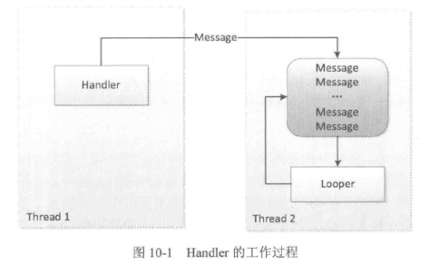
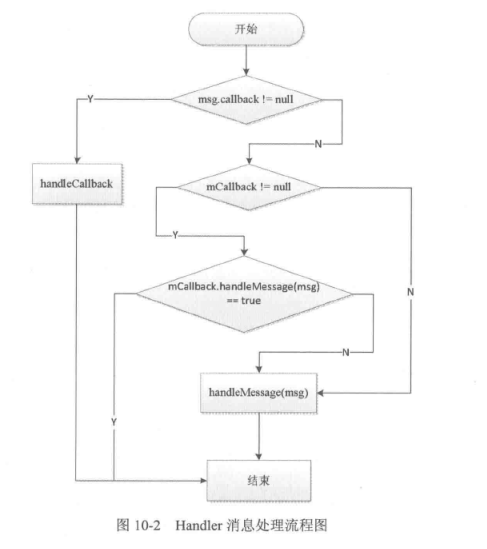

# Android的消息机制  

Android的消息机制主要是指Handler的运行机制，Handler的运行需要底层的MessageQueue和Looper的支撑。  

MesageQueue（消息队列）：它的内部存储了一组消息，以队列的形式对外提供插入和删除的工作。（内部存储结构并不是真正的队列，而是采用单链表的数据结构来存储消息列表）。 

Looper（循环）：消息循环。以无限循环的形式去查找是否新消息，如果有的话就处理消息，否则就一直等待着。  

ThreadLocal: 类似于是一个线程内部存储数据的局部变量，在这用来存储Looper。

线程是默认没有Looper的，如果需要使用Handler就必须为线程创建Looper。

## **Android的消息机制概述**  

Android的消息机制主要是指Handler的运行机制以及Handler所附带的MessageQueue和Looper的工作过程。  

Handler的主要作用是将一个任务切换到某个指定的线程中去执行。  

Android规定访问UI只能在主线程中进行，如果子线程中访问UI，那么程序就会抛出异常。ViewRootImpl对UI操作做了验证，这个验证工作是由ViewRootImpl的checkThread方法来完成的。
```Java
void checkThread(){
    if(mThread!=Thread.currentThread()){
        throw new CalledFromWrongThreadExpection(
            "Only the original thread that created a view hierarchy can touch its views.");
    }
}
```

Handler的工作过程  


## **Android的消息机制分析**
- ThreadLocal的工作原理  

  ThreadLocal是一个线程内部的数据存储类，通过它可以在指定的线程中存储数据，数据存储后，只有在指定的线程中可以获取到存储的数据。  

  对于Handler来说,它需要获取当前线程的Looper,很显然Looper的作用域就是线程并且不同线程具有不同的Looper,这个时候通过ThreadLocal就可以轻松实现Looper在线程中的存取。

- 消息队列的工作原理

  消息队列在Android中指的是MessageQueue，MessageQueue主要包含两个操作：**插入**和**读取**。读取操作本身会伴随着删除操作,插入和读取对应的方法分别为enqueueMessage和next,其中enqueueMessage的作用是往消息队列中插入一条消息,而next的作用是从消息队列中取出一条消息并将其从消息队列中移除。尽管MessageQueue叫消息队列,但是它的内部实现并不是用的队列,实际上它是通过一个**单链表的数据结构**来维护消息列表,单链表在插入和删除上比较有优势。

    - enqueueMessage的主要操作是单链表的插入操作。
    - next方法是一个无限循环的方法，如果消息队列中没有消息，那么next方法会一直阻塞在这里。当有新消息到来时，next 方法会返回这条消息并将其从单链表中移除。

- Looper的工作原理  

  Looper在Android的消息机制中扮演着消息循环的角色，具体来说它会不停地从MessageQueue中中查看  是否有新消息，如果有新消息就会立刻处理，否则就一直阻塞在那里。  

  构造方法（在构造方法中它会创建一个MessageQueue，并且持有一个当前线程的引用）
  ```Java
  private Looper(boolean quitAllowed){
    mQueue=new MessageQueue(quitAllowed);
    mThread=Thread.currentThread();
  }
  ```

  通过Looper.prepare()即可为当前线程创建一个Looper,接着通过Looper.loop()来开启消息循环：
  ```Java
  new Thread("Thread#2"){
    public void run(){
        Looper.prepare();
        Handler handler=new Handler();
        Looper.loop();
    };
  }.start();
  ```
  Looper除了prepare方法外,还提供了**prepareMainLooper方法**,这个方法主要是给*主线程*也就是*ActivityThread创建Looper*使用的,其本质也是通过prepare方法来实现的。由于主线程的Looper比较特殊,所以Looper提供了一个**getMainLooper方法**,通过它可以在任何地方获取到主线程的Looper.  

  Looper提供了**quit**和**quitSafely**来退出一个Looper,二者的区别是: quit会**直接**退出Looper,而quitSafely只是**设定一个退出标记**,然后把消息队列中的已有消息处理完毕后才安全地退出。Looper退出后,通过Handler发送的消息会失败,这个时候Handler的send方法会返回false。(*在子线程中,如果手动为其创建了Looper,那么在所有的事情完成以后应该调用quit方法来终止消息循环,否则这个子线程就会一直处于等待的状态,而如果退出Looper以后,这个线程就会立刻终止，因此建议不需要的时候终止Looper。*)  

  Looper最重要的一个方法是loop方法，只有调用loop后，消息循环系统才会真正地起作用。loop方法是一个死循环,唯一跳出循环的方式是MessageQueue的next方法返回了*null*。当Looper的quit方法被调用时, Looper就会调用MessageQueue的quit或者quitafely方法来通知消息队列退出,**当消息队列被标记为退出状态时,它的next方法就会返回null,也就是说, Looper必须退出,否则loop方法就会无限循环下去。**

  ***如果MessageQueue的next方法返回了新消息, Looper就会处理这条消息:msg.target.dispatchMessage(msg),这里的msg.target是发送这条消息的Handler对象,这样Handler发送的消息最终又交给它的dispatchMessage方法来处理了。但是这里不同的是,Handler的dispatchMessage方法是在创建Handler时所使用的Looper中执行的,这样就成功地将代码逻辑切换到指定的线程中去执行了。*** (流程)

- Handler的工作原理  
  Handler的工作主要包含发送和接收过程。消息的发送可以通过post的一系列方法以及send的一系列方法来实现，post的一系列方法最终是通过send的一系列方法来实现的。

  Handler发送消息的过程仅仅是向消息队列中插入一条消息，MessageQueue的next方法就会返回这条消息给Looper，Looper收到消息后就会开始处理了，最终消息由Looper交由Handler处理，即Handler的dispatchMessage方法会被调用，这是Handler就进入了处理消息的阶段。
  ```Java
  public void dispatchMessage(Message msg){
    if(msg.callback!=null){
        handleCallback(msg);
    }else{
        if(mCallback!=null){
            if(mCallback.handleMessage(msg)){
                return;
            }
        }
        handleMessage(msg);
    }
  } 
  ```
  Handler处理消息的过程如下： 

    - 首先,检查Message的callback是否为null,不为null就通过handleCallback来处理消息。Message的callback是一个Runnable对象,实际上就是Handler的post方法所传递的Runnable参数,handleCallback的逻辑也是很简单,如下所示
    ```Java
    private static void handleCallback(Message message){
        message.callback.run();
    }
    ```
    - 其次检查mCallback是否为null，不为null就调用mCallback的handleMessage放了来处理消息。Callback是个接口，它的定义如下：
    ```Java
    public interface Callback{
        public boolean handleMessage(Message msg);
    }
    ```
    通过Callback可以采用如下方式创建Handler对象：Handler handler=new Handler(callback)。

    - 最后调用Handler的HandlerMessage方法来处理消息。

    

## **主线程的消息机制**  

Android的主线程就是ActivityThread，主线程的入口方法在main，在main方法中系统会通过Looper.prepareMainLooper()来创建主线程的Looper以及MessageQueue,并通过Looper.loop()来开启主线程的消息循环，这个过程如下所示：
```java
public static void main(String [] args){
    ...
    Process.setArgV0("<pre-initialized>");
    
    Looper.perpareMainLooper();
    
    ActivityThread thread=new ActivityThread();
    thread.attach(false);
    
    if(sMainThreadHandler==null){
        sMainThreadHandler==thread.getHandler();
    }
    
    AsyncTask.init();
    
    if(false){
        Looper.myLooper().setMessageLogging(new
                LogPrinter(Log.DEBUG,"ActivityThread"));
    }
    
    Looper.loop();
    
    throw new RuntimeException("Main thread loop unexpectedly exited");
}
```
主线程的消息循环开始以后，ActivityThread还需要一个Handler来和消息队列进行交互，这个Handler就是ActivityThread.H，它内部定义了一组消息类型，主要包含了四大组件的启动和停止过程。