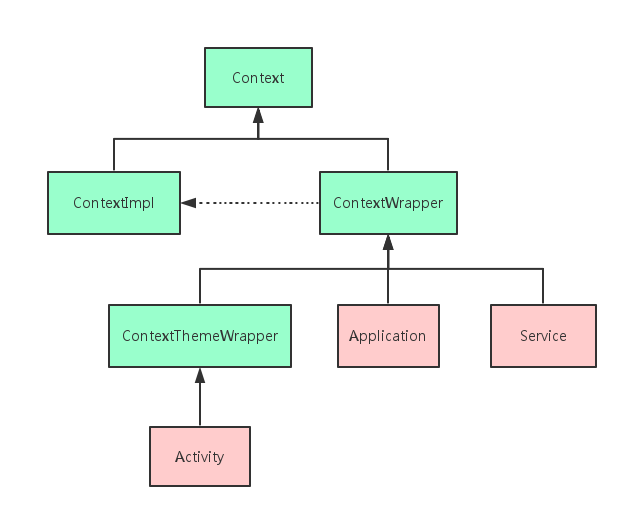

# 什么是Content
一个Activity就是一个Context，一个Service也是一个Context。

源码中的注释是这么来解释Context的：Context提供了关于应用环境全局信息的接口。它是一个抽象类，它的执行被Android系统所提供。它允许获取以应用为特征的资源和类型，是一个统领一些资源（应用程序环境变量等）的上下文。就是说，它描述一个应用程序环境的信息（即上下文）；是一个抽象类，Android提供了该抽象类的具体实现类；通过它我们可以获取应用程序的资源和类（包括应用级别操作，如启动Activity，发广播，接受Intent等）。既然上面Context是一个抽象类，那么肯定有他的实现类咯，我们在Context的源码中通过IDE可以查看到他的子类最终可以得到如下关系图：



Context的两个子类分工明确，其中ContextImpl是Context的具体实现类，ContextWrapper是Context的包装类。Activity，Application，Service虽都继承自ContextWrapper（Activity继承自ContextWrapper的子类ContextThemeWrapper），但它们初始化的过程中都会创建ContextImpl对象，由ContextImpl实现Context中的方法。

# 一个应用有多少个Content
Context数量=Activity数量+Service数量+1

Broadcast Receiver，Content Provider并不是Context的子类，他们所持有的Context都是其他地方传过去的，所以并不计入Context总数。

# Content的作用
弹出Toast、启动Activity、启动Service、发送广播、操作数据库等等都需要用到Context。
```java
TextView tv = new TextView(getContext());

ListAdapter adapter = new SimpleCursorAdapter(getApplicationContext(), ...);

AudioManager am = (AudioManager) getContext().getSystemService(Context.AUDIO_SERVICE);getApplicationContext().getSharedPreferences(name, mode);

getApplicationContext().getContentResolver().query(uri, ...);

getContext().getResources().getDisplayMetrics().widthPixels * 5 / 8;

getContext().startActivity(intent);

getContext().startService(intent);

getContext().sendBroadcast(intent);
```

# Content作用域
虽然Context神通广大，但并不是随便拿到一个Context实例就可以为所欲为，它的使用还是有一些规则限制的。由于Context的具体实例是由ContextImpl类去实现的，因此在绝大多数场景下，Activity、Service和Application这三种类型的Context都是可以通用的。不过有几种场景比较特殊，比如启动Activity，还有弹出Dialog。出于安全原因的考虑，Android是不允许Activity或Dialog凭空出现的，一个Activity的启动必须要建立在另一个Activity的基础之上，也就是以此形成的返回栈。而Dialog则必须在一个Activity上面弹出（除非是System Alert类型的Dialog），因此在这种场景下，我们只能使用Activity类型的Context，否则将会出错。

|Context作用域|Application|Activity|Service|
|-|-|-|-|
|Show a Dialog|N|Y|N|
|Start an Activity|不推荐|Y|不推荐|
|Layout Inflation|不推荐|Y|不推荐|
|Start a Service|Y|Y|Y|
|Send a Broadcast|Y|Y|Y|
|Register Broadcast Receiver|Y|Y|Y|
|Load Resource Values|Y|Y|Y|

总结：凡是跟UI相关的，都应该使用Activity做为Context来处理；其他的一些操作，Service,Activity,Application等实例都可以，当然了，注意Context引用的持有，防止内存泄漏。

# 获取Content
1. View.getContent,返回当前View对象的Content对象，通常是当前正在展示的Activity对象。
2. Activity.getApplicationContext,获取当前Activity所在的(应用)进程的Context对象，通常我们使用Context对象时，要优先考虑这个全局的进程Context。
3. ContextWrapper.getBaseContext():用来获取一个ContextWrapper进行装饰之前的Context，可以使用这个方法，这个方法在实际开发中使用并不多，也不建议使用。
4. Activity.this 返回当前的Activity实例，如果是UI控件需要使用Activity作为Context对象，但是默认的Toast实际上使用ApplicationContext也可以。

### getApplication()和getApplicationContext()区别
这两个方法得到的结果都是相同的，但这两个方法在作用域上有比较大的区别。getApplication()方法的语义性非常强，一看就知道是用来获取Application实例的，但是这个方法只有在**Activity和Service中才能调用的到。**那么也许在绝大多数情况下我们都是在Activity或者Service中使用Application的，但是如果在一些其它的场景，比如BroadcastReceiver中也想获得Application的实例，这时就可以借助getApplicationContext()方法了。

# Context引起的内存泄露
**ERROR Demo：**
```java
public class Singleton {
    private static Singleton instance;
    private Context mContext;

    private Singleton(Context context) {
        this.mContext = context;
    }

    public static Singleton getInstance(Context context) {
        if (instance == null) {
            instance = new Singleton(context);
        }
        return instance;
    }
}
```
这是一个非线程安全的单例模式，instance作为静态对象，其生命周期要长于普通的对象，其中也包含Activity，假如Activity A去getInstance获得instance对象，传入this，常驻内存的Singleton保存了你传入的Activity A对象，并一直持有，即使Activity被销毁掉，但因为它的引用还存在于一个Singleton中，就不可能被GC掉，这样就导致了内存泄漏。

**ERROR Demo：**
```java
public class MainActivity extends Activity {
    private static Drawable mDrawable;

    @Override
    protected void onCreate(Bundle saveInstanceState) {
        super.onCreate(saveInstanceState);
        setContentView(R.layout.activity_main);
        ImageView iv = new ImageView(this);
        mDrawable = getResources().getDrawable(R.drawable.ic_launcher);
        iv.setImageDrawable(mDrawable);
    }
}
```
有一个静态的Drawable对象，当ImageView设置这个Drawable时，ImageView保存了mDrawable的引用，而ImageView传入的this是MainActivity的mContext，因为被static修饰的mDrawable是常驻内存的，MainActivity是它的间接引用，MainActivity被销毁时，也不能被GC掉，所以造成内存泄漏。

### 正确使用Context
一般Context造成的内存泄漏，几乎都是当Context销毁的时候，却因为被引用导致销毁失败，而Application的Context对象可以理解为随着进程存在的，所以我们总结出使用Context的正确姿势：

- 当Application的Context能搞定的情况下，并且生命周期长的对象，优先使用Application的Context。

- 不要让生命周期长于Activity的对象持有到Activity的引用。

- 尽量不要在Activity中使用非静态内部类，因为非静态内部类会隐式持有外部类实例的引用，如果使用静态内部类，将外部实例引用作为弱引用持有。