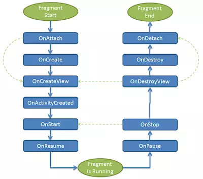

## [文章转载地址](https://juejin.im/post/5cadbe046fb9a068ad1b0578)

# Fragment
- Fragment是依赖于Activity的，不能独立存在的。
- 一个Activity里可以有多个Fragment。
- 一个Fragment可以被多个Activity重用。
- Fragment有自己的生命周期，并能接收输入事件。
- 我们能在Activity运行时动态地添加或删除Fragment

# Fragment的优势
- 模块化（Modularity）：我们不必把所有代码全部写在Activity中，而是把代码写在各自的Fragment中。
- 可重用（Reusability）：多个Activity可以重用一个Fragment。
- 可适配（Adaptability）：根据硬件的屏幕尺寸、屏幕方向，能够方便地实现不同的布局，这样用户体验更好。

# Fragment核心类
- Fragment:Fragment的基类，任何创建的Fragment都需要继承该类。
- FragmentManager:管理和维护Fragment。抽象类，具体的实现类是FragmentManagerImpl。
- FragmentTransaction:对Fragment的添加、删除等操作都需要通过事务方式进行，抽象类，具体的实现类是BackStackRecord。

# Fragment基本使用
Fragment有很多可以复写的方法，其中最常用的就是**onCreateView()**，该方法返回Fragment的UI布局，需要注意的是inflate()的第三个参数是false，因为在Fragment内部实现中，会把该布局添加到container中，如果设为true，那么就会重复做两次添加，则会抛如下异常：
```java
Caused by: java.lang.IllegalStateException: The specified child already has a parent. You must call removeView() on the child's parent first.
```

如果在创建Fragment时要传入参数，必须要通过**setArguments(Bundle bundle)方式添加，setArguments方法必须在fragment创建以后，添加给Activity前完成,**而不建议通过为Fragment添加带参数的构造函数，因为**通过setArguments()方式添加，在由于内存紧张导致Fragment被系统杀掉并恢复（re-instantiate）**时能保留这些数据。

我们可以在Fragment的**onAttach()**中通过getArguments()获得传进来的参数，并在之后使用这些参数。

**如果要获取Activity对象，不建议调用getActivity()，而是在onAttach()中将Context对象强转为Activity对象。**

在Activity中添加Fragment的方式有两种：
- 静态添加：在xml中通过的方式添加，缺点是一旦添加就不能在运行时删除。

- 动态添加：运行时添加，这种方式比较灵活，因此建议使用这种方式。 虽然Fragment能在XML中添加，但是这只是一个语法糖而已，Fragment并不是一个View，而是和Activity同一层次的。

注意：

- 因为我们使用了support库的Fragment，因此需要使用*getSupportFragmentManager()*获取FragmentManager,通过getSupportFragmentManager()获取的FragmentManager*只能管理Activity里面嵌入的所有一级fragment*。

- add()是对Fragment众多操作中的一种，还有remove(), replace()等，第一个参数是根容器的id，第二个参数是Fragment对象，第三个参数是fragment的tag名，指定tag的好处是后续我们可以通过*Fragment1 frag = getSupportFragmentManager().findFragmentByTag("f1")*从FragmentManager中查找Fragment对象。

- 在一次事务中，可以做多个操作，比如同时做add().remove().replace()。

- *commit()操作是异步的*，内部通过*mManager.enqueueAction()*加入处理队列。对应的同步方法为*commitNow()*，commit()内部会有*checkStateLoss()*操作，如果开发人员使用不当（比如commit()操作在onSaveInstanceState()之后），可能会抛出异常，而commitAllowingStateLoss()方法则是不会抛出异常版本的commit()方法，但是*尽量使用commit()*，而不要使用commitAllowingStateLoss()。

- addToBackStack("fname")是可选的。FragmentManager拥有*回退栈（BackStack）*，类似于Activity的任务栈，*如果添加了该语句，就把该事务加入回退栈，当用户点击返回按钮，会回退该事务（回退指的是如果事务是add(frag1)，那么回退操作就是remove(frag1)）；如果没添加该语句，用户点击返回按钮会直接销毁Activity。*

- Fragment有一个常见的问题，即Fragment重叠问题，这是由于Fragment被系统杀掉，并重新初始化时再次将fragment加入activity，因此通过在外围加if语句能判断此时是否是被系统杀掉并重新初始化的情况。解决方法有三种：

    - 第一种方式，在 Activity 提供的 onAttachFragment() 方法中处理：
    ```java
    @Override
        public void onAttachFragment(Fragment fragment) {
            super.onAttachFragment(fragment);
            if (fragment instanceof  OneFragment){
            oneFragment = (OneFragment) fragment;
        }
    }
    ```

    - 第二种方式，在创建 Fragment 前添加判断，判断是否已经存在：
    ```java
        Fragment tempFragment = getSupportFragmentManager().findFragmentByTag   ("OneFragment");
        if (tempFragment==null) {
            oneFragment = OneFragment.newInstance();
            ft.add(R.id.fl_content, oneFragment, "OneFragment");
        }else {
            oneFragment = (OneFragment) tempFragment;
        }
    ```

    - 第三种方式，更为简单，直接利用 savedInstanceState 判断即可：
    ```java
    if (savedInstanceState==null) {
        oneFragment = OneFragment.newInstance();
        ft.add(R.id.fl_content, oneFragment, "OneFragment");
    }else {
        oneFragment = (OneFragment) getSupportFragmentManager().findFragmentByTag("OneFragment");
    }
    ```

# 常见异常
```java
java.lang.IllegalStateException: Can not perform this action after onSaveInstanceState
at android.support.v4.app.FragmentManagerImpl.checkStateLoss(FragmentManager.java:1341)
at android.support.v4.app.FragmentManagerImpl.enqueueAction(FragmentManager.java:1352)
at android.support.v4.app.BackStackRecord.commitInternal(BackStackRecord.java:595)
at android.support.v4.app.BackStackRecord.commit(BackStackRecord.java:574)
```

该异常出现的原因是：commit()在onSaveInstanceState()后调用。首先，onSaveInstanceState()是在Activity有可能被系统回收的情况下，而且是在onPause()之后，onStop()之前调用。onRestoreInstanceState()在onStart()之后，onResume()之前。

*解释一下：onSaveInstanceState()是当activity有可能被系统回收的情况下，而且是在onStop()之前。注意是有可能，如果是已经确定会被销毁，比如用户按下了返回键，或者调用了finish()方法销毁activity，则onSaveInstanceState不会被调用。或者也可以说，此方法只有在activity被异常终止的情况下会被调用。*
*onRestoreInstanceState(Bundle savedInstanceState)只有在activity确实是被系统回收，重新创建activity情况下才会被调用，并且是在onStart()之后，onResume()之前的。*

因此避免出现该异常的方案有：

- 不要把Fragment事务放在异步线程的回调中，比如不要把Fragment事务放在AsyncTask的onPostExecute()，因此onPostExecute()可能会在onSaveInstanceState()之后执行。
- 逼不得已时使用commitAllowingStateLoss()。

# 生命周期


- onAttach(Context context)：Fragment和Activity相关联时调用。如果不是一定要使用具体的宿主 Activity 对象的话，可以使用这个方法或者getContext()获取 Context 对象，用于解决Context上下文引用的问题。同时还可以在此方法中可以通过getArguments()获取到需要在Fragment创建时需要的参数。
- onCreate()：Fragment被创建时调用。
- onCreateView()：创建Fragment的布局。
- onActivityCreated()：当Activity完成onCreate()时调用。
- onStart()：当Fragment可见时调用。
- onResume()：当Fragment可见且可交互时调用。
- onPause()：当Fragment不可交互但可见时调用。
- onStop()：当Fragment不可见时调用。
- onDestroyView()：当Fragment的UI从视图结构中移除时调用。
- onDestroy()：销毁Fragment时调用。
- onDetach()：当Fragment和Activity解除关联时调用。

*上面的方法中，只有onCreateView()在重写时不用写super方法，其他都需要。*

### FragmentTransaction有一些基本方法，下面给出调用这些方法时，Fragment生命周期的变化：

- add(): onAttach()->onCreate()->onCreateView()->onActivityCreated()->onStart()->onResume()，在执行add（）时，同一个Fragment不允许被add()两次

- remove(): onPause()->onStop()->onDestroyView()->onDestroy()->onDetach()。

- replace():相当于新Fragment调用add()，旧Fragment调用remove(), replace() 方法不会保留Fragment的状态，也就是说诸如EditText内容输入等用户操作在remove()时会消失。分为两种情况

    - 不加addToBackStack（）: new onAttach() -> new onCreate() -> old onPause()-> old onStop()-> old onDestroyView()-> old onDestroy()-> old onDetach() -> new onCreateView() -> new onActivityCreated() -> new onStart()。

    - 加addToBackStack（）: new onAttach() -> new onCreate() -> old onPause()-> old onStop()-> old onDestroyView() -> new onCreateView -> new  onActivityCreated() -> new onStart()。


- show(): 不调用任何生命周期方法，调用该方法的前提是要显示的Fragment已经被添加到容器，只是纯粹把Fragment UI的setVisibility为true。

- hide(): 不调用任何生命周期方法，调用该方法的前提是要显示的Fragment已经被添加到容器，只是纯粹把Fragment UI的setVisibility为false。

- detach(): 仅仅是销毁fragment的UI，Fragment还被fragmentManager管理。onPause()->onStop()->onDestroyView()。

- attach(): 重新添加是被detach销毁的fragment。onCreateView() -> onActivityCreated -> onStart() -> onResume()。

- commit():提交事务。每次提交之前，必须通过mFragmentManager.beginTransaction()重新开始一个事务。

# Fragment返回栈
我们知道Activity有任务栈，用户通过startActivity将Activity加入栈，点击返回按钮将Activity出栈。Fragment也有类似的栈，称为回退栈（Back Stack），回退栈是由FragmentManager管理的。默认情况下，Fragment事务是不会加入回退栈的，如果想将Fragment事务加入回退栈，则可以加入addToBackStack("")。如果没有加入回退栈，则用户点击返回按钮会直接将Activity出栈；如果加入了回退栈，则用户点击返回按钮会回滚Fragment事务。

# Fragment通讯
## Fragment向Activity传递数据
通过接口实现：首先，在Fragment中定义接口，并让Activity实现该接口。在Fragment的onAttach()中，将参数Context强转为对应接口对象，并在Fragment合适的地方调用接口将数据从Fragment传递给Activity。

FABridge：由于通过接口的方式从Fragment向Activity进行数据传递比较麻烦，需要在Fragment中定义interface，并让Activity实现该interface，FABridge通过@FCallbackId注解的形式免去了这些定义。

## Activity向Fragment传递数据
- 如果在创建Fragment时要传入参数，必须要通过setArguments(Bundle bundle)方式添加，setArguments方法必须在fragment创建以后，添加给Activity前完成,而不建议通过为Fragment添加带参数的构造函数，因为通过setArguments()方式添加，在由于内存紧张导致Fragment被系统杀掉并恢复（re-instantiate）时能保留这些数据。
```java
public static Fragment newInstance(String str) {
    FragmentTest fragment = new FragmentTest();
    Bundle bundle = new Bundle();
    bundle.putString(ARG_PARAM, str);
    fragment.setArguments(bundle);//设置参数
    return fragment;
}
```

- Activity向Fragment传递数据比较简单，获取Fragment对象，并调用Fragment的方法即可，比如要将一个字符串传递给Fragment，则在Fragment中定义方法：
```java
public void setString(String str) {
    this.str = str;
}
```

## Fragment之间通信
由于Fragment之间是没有任何依赖关系的，因此如果要进行Fragment之间的通信，建议通过Activity作为中介，不要Fragment之间直接通信。

# DialogFragment
DialogFragment是Android 3.0提出的，代替了Dialog，用于实现对话框。他的优点是：即使旋转屏幕，也能保留对话框状态。
如果要自定义对话框样式，只需要继承DialogFragment，并重写onCreateView()，该方法返回对话框UI。

# ViewPager+Fragment
ViewPager是support v4库中提供界面滑动的类，继承自ViewGroup。PagerAdapter是ViewPager的适配器类，为ViewPager提供界面。但是一般来说，通常都会使用PagerAdapter的两个子类：FragmentPagerAdapter和FragmentStatePagerAdapter作为ViewPager的适配器，他们的特点是界面是Fragment。

默认，ViewPager会缓存当前页相邻的界面，比如当滑动到第2页时，会初始化第1页和第3页的界面（即Fragment对象，且生命周期函数运行到onResume()），可以通过setOffscreenPageLimit(count)设置离线缓存的界面个数。

FragmentPagerAdapter和FragmentStatePagerAdapter需要重写的方法都一样，常见的重写方法如下：
- public FragmentPagerAdapter(FragmentManager fm): 构造函数，参数为FragmentManager。如果是嵌套Fragment场景，子PagerAdapter的参数传入getChildFragmentManager()。

- Fragment getItem(int position): 返回第position位置的Fragment，必须重写。
int getCount(): 返回ViewPager的页数，必须重写。

- Object instantiateItem(ViewGroup container, int position): container是ViewPager对象，返回第position位置的Fragment。

- void destroyItem(ViewGroup container, int position, Object object): container是ViewPager对象，object是Fragment对象。

- getItemPosition(Object object): object是Fragment对象，如果返回POSITION_UNCHANGED，则表示当前Fragment不刷新，如果返回POSITION_NONE，则表示当前Fragment需要调用destroyItem()和instantiateItem()进行销毁和重建。默认情况下返回POSITION_UNCHANGED。

# Fragment 处理返回键
虽然Activity作为Fragment的载体，但是在有些特殊（例如按下返回键，Fragment 直接把结果发送到 Activity载体）的情况下，Fragment也不得不处理返回键事件。如果是Activity的话还好说，直接覆盖Activity的onBackPressed即可，但是Fragment却没有这个onBackPressed方法，需要自己进行处理。其实在开发的时候都会封装Fragment和Activity的用于实现自己的逻辑.

1. 新建一个接口：OnBackPressed
```java
public interface OnBackPressed {
 boolean onBackPressed();
}
```

2. 封装一个片段：BaseFragment 实现 OnBackPressed
```java
public class BaseFragment extends Fragment implements OnBackPressed {

 /**
  * fragment 中的返回键
  * 默认返回 false,交给Activity 处理
  * 返回 true:执行fragment中需要执行的逻辑
  * 返回 false:执行Activity中的onBackPressed
  */
 @Override
 public boolean onBackPressed() {
     return false;
 }
}
```

3. 在Activity中的onBackPressed进行判断即可:
```java
@Override
public void onBackPressed() {
    List<Fragment> fragments = getSupportFragmentManager().getFragments();

    for (Fragment f : fragments) {
        if (f != null && f instanceof BaseFragment&& ((BaseFragment) f).onBackPressed()) {
           /*在Fragment中处理返回事件*/
           return;
        }
    }
    super.onBackPressed();
}

```

4. 自己的Fragment继承BaseFragment并重写onBackPressed方法
```java
@Override
public boolean onBackPressed() {
    super.onBackPressed();
   /*处理返回事件*/
    return true;
}
```

# 懒加载
懒加载主要用于ViewPager且每页是Fragment的情况，场景为微信主界面，底部有4个tab，当滑到另一个tab时，先显示”正在加载”，过一会才会显示正常界面。

这里懒加载的实现思路是：用户不可见的界面，只初始化UI，但是不会做任何数据加载。等滑到该页，才会异步做数据加载并更新UI。

懒加载主要依赖Fragment的setUserVisibleHint(boolean isVisible)方法，当Fragment变为可见时，会调用setUserVisibleHint(true)；当Fragment变为不可见时，会调用setUserVisibleHint(false)，且该方法调用时机：

- onAttach()之前，调用setUserVisibleHint(false)。
- onCreateView()之前，如果该界面为当前页，则调用setUserVisibleHint(true)，否则调用setUserVisibleHint(false)。
- 界面变为可见时，调用setUserVisibleHint(true)。
- 界面变为不可见时，调用setUserVisibleHint(false)。
懒加载Fragment的实现：
```java
public class LazyFragment extends Fragment {
    private View mRootView;
    private boolean mIsInited;
    private boolean mIsPrepared;
    @Override
    public View onCreateView(LayoutInflater inflater, ViewGroup container, Bundle savedInstanceState) {
        mRootView = inflater.inflate(R.layout.fragment_lazy, container, false);
        mIsPrepared = true;
        lazyLoad();
        return mRootView;
    }
    public void lazyLoad() {
        if (getUserVisibleHint() && mIsPrepared && !mIsInited) {
            //异步初始化，在初始化后显示正常UI
            loadData();
        }
    }
    private void loadData() {
        new Thread() {
            public void run() {
                //1. 加载数据
                //2. 更新UI
                //3. mIsInited = true
            }
        }.start();
    }
    @Override
    public void setUserVisibleHint(boolean isVisibleToUser) {
        super.setUserVisibleHint(isVisibleToUser);
        if (isVisibleToUser) {
            lazyLoad();
        }
    }
    public static LazyFragment newInstance() {
        return new LazyFragment();
    }
}

```

注意：
- 在Fragment中有两个变量控制是否需要做数据加载：
    - mIsPrepared：表示UI是否准备好，因为数据加载后需要更新UI，如果UI还没有inflate，就不需要做数据加载，因为setUserVisibleHint()会在onCreateView()之前调用一次，如果此时调用，UI还没有inflate，因此不能加载数据。
    - mIsInited：表示是否已经做过数据加载，如果做过了就不需要做了。因为setUserVisibleHint(true)在界面可见时都会调用，如果滑到该界面做过数据加载后，滑走，再滑回来，还是会调用setUserVisibleHint(true)，此时由于mIsInited=true，因此不会再做一遍数据加载。

- lazyLoad()：懒加载的核心类，在该方法中，只有界面可见（getUserVisibleHint()==true）、UI准备好（mIsPrepared==true）、过去没做过数据加载（mIsInited==false）时，才需要调loadData()做数据加载，数据加载做完后把mIsInited置为true。

