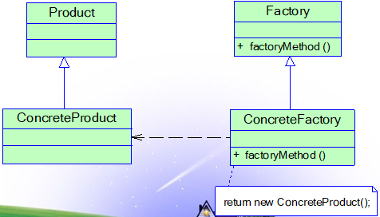

# 工厂方法(Factory Method Fattern)

一个用于创建对象的接口，但是**让子类决定将哪一个类实例化**。工厂方法模式让一个类的实例化**延迟到其子类**。是一个类创建型模式。

- 简称工厂模式，又可称作虚拟构造器模式或者多态工厂模式。

- 工厂父类负责定义创建产品对象的公共接口，而工厂子类则负责生产具体的产品对象。

- 目的是将产品类的实例化操作延迟到工厂子类中完成，即通过工厂子类来确定究竟应该实例化哪一个具体产品类。

## 模式结构

工厂方法的模式角色：

- Product(抽象产品)

- ConcreteProduct(具体产品)

- Factory(抽象工厂)

- ConcreteFactory(具体工厂)

## 优点

- 工厂方法用来创建客户所需要的产品，同时还**向客户隐藏了哪种具体产品类将被实例化这一细节**

- 能够**让工厂自主确定创建何种产品对象**，而如何创建这个对象的细节则完全封装在具体工厂内部

- 在系统中加入新产品时，**完全符合开闭原则**

## 缺点

- 系统中**类的个数将成对增加**，在一定程度上增加了系统的复杂度，会给系统带来一些额外的开销

- **增加了系统的抽象性和理解难度**

## 模式适用环境

- **客户端不知道它所需要的对象的类**（客户端不需要知道具体产品类的类名，只需要知道所对应的工厂即可，具体产品对象由具体工厂类创建）

- **抽象工厂类通过其子类来指定创建哪个对象**

