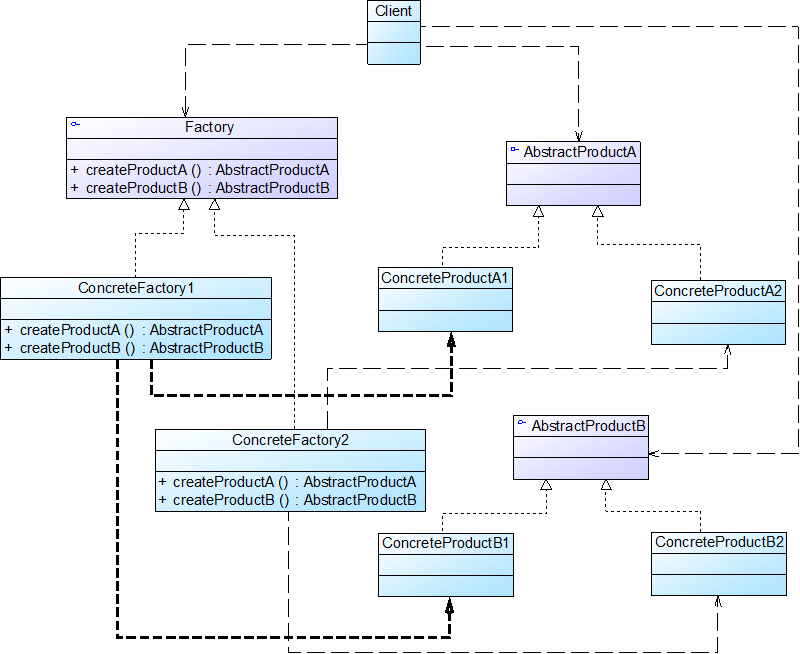

# 抽象工厂模式(Abstract Factory Pattern)

一个工厂可以生产一系列产品(一族产品)，极大减少了工厂类的数量。

提供一个创建一系列相关或者相互依赖对象的接口，而无需指定它们具体的类。对象创建型模式。

- 又称为工具(Kit)模式

- 抽象工厂模式中的具体工厂不只是创建一种产品，它**负责创建一族产品**

- 当一**个工厂等级结构可以创建出分属于不同产品等级结构的一个产品族中的所有对象时，抽象工厂模式比工厂方法模式更为简单、更有效率**

## 模式结构

抽象工程模式角色：
- AbstractFactory(抽象工厂)
- ConcreteFactory(具体工厂)
- AbstractProduct(抽象产品)
- ConcreteFactory(具体产品)

## 开闭原则的倾斜性

- 增加产品族  
对于增加新的产品族，抽象工厂很好地支持了开闭原则，只需要增加具体产品并对应增加一个新的具体工厂，对已有代码无须做任何修改

- 增加新的产品等级结构  
对于增加新的产品等级结构，需要修改所有的工厂角色吗，包括抽象工厂类，在所有的工厂类中都需要增加生产新产品的方法，违背了开闭原则

## 优点

- 隔离了具体类的生成，使得客户端并不需要知道什么被创建

- 当一个产品族中的多个对象被设计成一起工作时，它能够保证客户端始终只使用同一个产品族中的对象

- 增加新的产品族很方便，无须修改已有系统，符合开闭原则

## 缺点

- 增加新的产品等级结构麻烦，需要对原有系统进行较大的修改，甚至需要修改抽象层代码，这显然会带来较大的不便，违背了开闭原则

## 适用环境

- 一个系统不应当依赖于产品类实例如何被创建、组合和表达的细节

- 系统中有多于一个的产品族，但每次只使用其中某一产品族

- 属于同一个产品族的产品将在一起使用，这一约束必须在系统的设计中体现出来

- 产品等级结构稳定，在设计完成之后不会向系统中增加新的产品等级结构或者删除已有的产品等级结构
