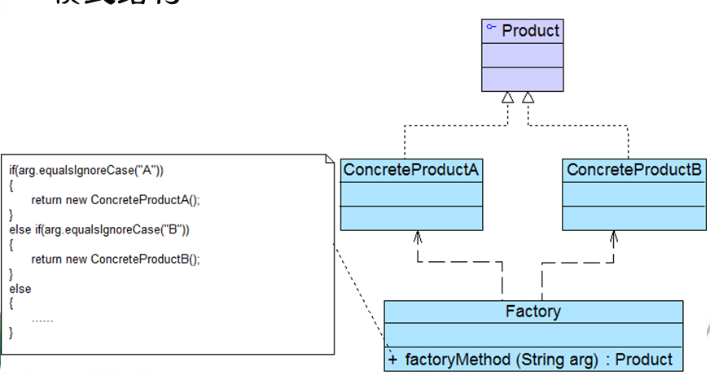

# 简单工厂(Simple Factory Pattern)

简单工厂模式又称为静态工厂方法(Static Factory Pattern)模式，它属于类创建型模式。在简单工厂模式中，可以根据参数的不同返回不同类的实例。**简单工厂模式专门定义一个类来负责创建其他类的实例，被创建的实例通常都具有共同的父类。**

## 模式结构

简单工厂模式角色：
- Factory:工厂角色
- Product:抽象产品角色
- ConcreteProduct:具体产品角色

## 优点
- 工厂类含有必要的判断逻辑，可以决定在什么时候创建哪一个产品类的实例，客户端可以免除直接创建产品对象的责任，而仅仅“消费”产品；简单工厂模式通过这种做法**实现了对责任的分割，它提供了专门的工厂类用于创建对象。**

- **客户端无须知道所创建的具体产品类的类名，只需要知道具体产品类所对应的参数即可，**对于一些复杂的类名，通过简单工厂模式可以减少使用者的记忆量。

- **通过引入配置文件，可以在不修改任何客户端代码的情况下更换和增加新的具体产品类，在一定程度上提高了系统的灵活性。**

## 缺点
- 由于**工厂类集中了所有产品创建逻辑**，一旦不能正常工作，整个系统都要受到影响。
- 使用简单工厂模式将会**增加系统中类的个数**，在一定程序上增加了系统的复杂度和理解难度。
- **系统扩展困难，一旦添加新产品就不得不修改工厂逻辑，在产品类型较多时，有可能造成工厂逻辑过于复杂，不利于系统的扩展和维护。**
- 简单工厂模式由于使用了静态工厂方法，造成**工厂角色无法形成基于继承的等级结构**。

## 适用环境
- **工厂类负责创建的对象比较少**：由于创建的对象较少，不会造成工厂方法中的业务逻辑太过复杂。

- **客户端只知道传入工厂类的参数，对于如何创建对象不关心：**客户端既不需要关心创建细节，甚至连类名都不需要记住，只需要知道类型所对应的参数。

