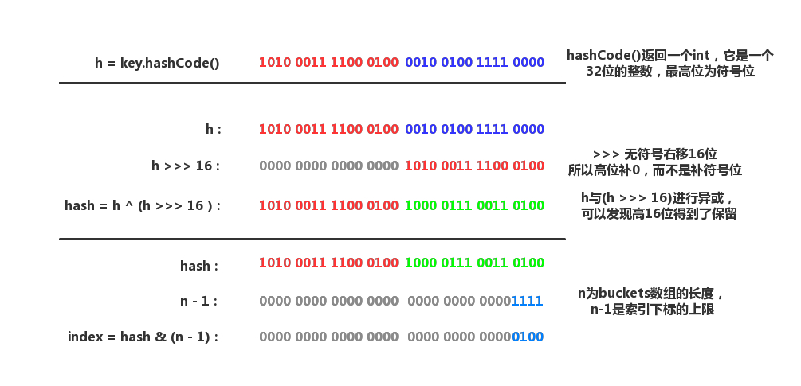
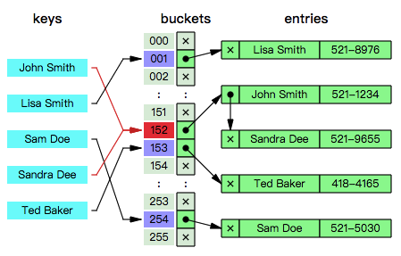

# HashMap  
HashMap继承AbstractMap<K,V>,实现Map<K,V>,Cloneable,Serializable接口。  

HashMap表中维护了一个数组。

桶(bucket):数组中的每一个元素，长度永远是一个2的幂。

容量(Capacity):bucket(桶)的大小(数量)。

  - 初始容量：哈希表创建时的容量。

负载因子(Load factor):bucket填满程度的最大比例。

  - 默认负载因子是0.75。

当bucket中的entries的数目大于**capacity*load factor**时就需要调整bucket的大小为当前的2倍。

HashMap的几个核心成员变量
```java
transient Node<K,V>[] table;//HashMap的哈希桶数组，用于存放表示键值对数据的Node元素。
transient Set<Map.Entry<K,V>> entrySet;//HashMap将数据转换成set的另一种存储形式，这个变量主要用于迭代功能。
transient int size;//HashMap中实际存在的Node数量，这个数量不等于table的长度，甚至可能大于它，因为在table的每个节点上是一个链表（或RBT）结构。
transient int modCount;//HashMap的数据被修改的次数，这个变量用于迭代过程中的Fail-Fast机制，其存在的意义在于保证发生了线程安全问题时，能及时的发现（操作前备份的count和当前modCount不相等）并抛出异常终止操作。
int threshold;//HashMap的扩容阈值，在HashMap中存储的Node键值对超过这个数量的时，自动扩容容量为原理的二倍。
final float loadFactor;//HashMap的负载因子，可计算出当前的table长度下的扩容阈值:threshold=loadFactor*table.length
```

HashMap定义的一些变量
```java
static final int DEFAULT_INITIAL_CAPACITY=1<<4;//默认的初始容量为16，必须是2的幂次
static final int MAXIMUM_CAPACITY=1<<30;//最大容量即2的30次方
static final float DEFAULT_LOAD_FACTOR=0.75f;//默认加载因子
static final int TREEIFY_THRESHOLD=8;//当put一个元素时，其链表长度达到8时将链表转换为红黑树
static final int UNTREEIFY_THRESHOLD=6;//链表长度小于6时，解散红黑树
static final int MIN_TREEIFY_CAPACITY=64;//默认的最小的扩容量64，为避免重新扩容冲突，至少为4*TREEIFY_THRESHOLD=32,即默认初始值容量的两倍。
```

## hash

hash算法：将任意大小的数据(输入)映射到一个固定大小的序列(输出)上，这个序列被称为hash code。比较出名的hash算法有MD5、SHA。

hash具有*唯一性*和*不可逆转性*

碰撞冲突：*唯一性保证了相同输入的输出是一致的*，却没有保证不同输入的输出是不一致的，也就是说，完全有可能两个不同的key被分配到了同一个bucket（因为它们的hash code可能是相同的）。

HashMap内部实现的hash()函数，首先对hashCode()的返回值进行处理。
```java
    static final int hash(Object key) {
        int h;
        return (key == null) ? 0 : (h = key.hashCode()) ^ (h >>> 16);
    }
```
  

将key.hashCode()的低16位和高16位做异或运算，其目的是为了扰乱低位信息以实现减少碰撞重提。

## 解决冲突

- HashMap使用了拉链法(Separate chaining)的策略来解决冲突。即数组+链地址的方式。  
  主要思想是每个bucket都应当是一个互相独立的数据结构，当发生冲突时，只需要把数据放入bucket中（因为bucket本身也是一个可以  存放数据的数据结构），这样查询一个key所消耗的时间为访问bucket所消耗的时间加上在bucket中查找的时间。
  
  HashMap的buckets数组其实就是一个*链表数组*。
  
  

- 阈值  
  
  ```java
  static final int TREEIFY_THRESHOLD = 8;
  ```

  如果在插入Entry时发现一条链表超过阈值，就会执行以下的操作，对该*链表进行树化*；相对的，如果在删除Entry（或进行扩容）时发现红黑树的节点太少（根据阈值UNTREEIFY_THRESHOLD），也会把*红黑树退化成链表*。

