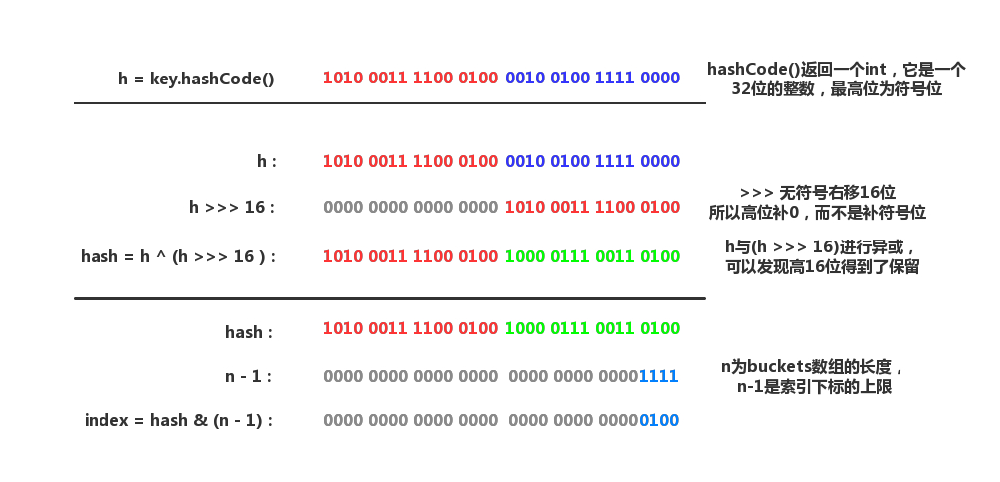
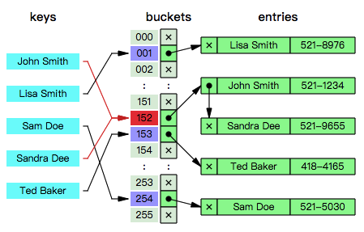

# HashMap  
HashMap继承AbstractMap<K,V>,实现Map<K,V>,Cloneable,Serializable接口。  

HashMap表中维护了一个数组。

桶(bucket):数组中的每一个元素，长度永远是一个2的幂。

容量(Capacity):bucket(桶)的大小(数量)。

  - 初始容量：哈希表创建时的容量。

负载因子(Load factor):bucket填满程度的最大比例。

  - 默认负载因子是0.75。

当bucket中的entries的数目大于**capacity*load factor**时就需要调整bucket的大小为当前的2倍。

HashMap的几个核心成员变量
```java
transient Node<K,V>[] table;//HashMap的哈希桶数组，用于存放表示键值对数据的Node元素。
transient Set<Map.Entry<K,V>> entrySet;//HashMap将数据转换成set的另一种存储形式，这个变量主要用于迭代功能。
transient int size;//HashMap中实际存在的Node数量，这个数量不等于table的长度，甚至可能大于它，因为在table的每个节点上是一个链表（或RBT）结构。
transient int modCount;//HashMap的数据被修改的次数，这个变量用于迭代过程中的Fail-Fast机制，其存在的意义在于保证发生了线程安全问题时，能及时的发现（操作前备份的count和当前modCount不相等）并抛出异常终止操作。
int threshold;//HashMap的扩容阈值，在HashMap中存储的Node键值对超过这个数量的时，自动扩容容量为原理的二倍。
final float loadFactor;//HashMap的负载因子，可计算出当前的table长度下的扩容阈值:threshold=loadFactor*table.length
```

HashMap定义的一些变量
```java
static final int DEFAULT_INITIAL_CAPACITY=1<<4;//默认的初始容量为16，必须是2的幂次
static final int MAXIMUM_CAPACITY=1<<30;//最大容量即2的30次方
static final float DEFAULT_LOAD_FACTOR=0.75f;//默认加载因子
static final int TREEIFY_THRESHOLD=8;//当put一个元素时，其链表长度达到8时将链表转换为红黑树
static final int UNTREEIFY_THRESHOLD=6;//链表长度小于6时，解散红黑树
static final int MIN_TREEIFY_CAPACITY=64;//默认的最小的扩容量64，为避免重新扩容冲突，至少为4*TREEIFY_THRESHOLD=32,即默认初始值容量的两倍。
```

## hash

hash算法：将任意大小的数据(输入)映射到一个固定大小的序列(输出)上，这个序列被称为hash code。比较出名的hash算法有MD5、SHA。

hash具有*唯一性*和*不可逆转性*

碰撞冲突：*唯一性保证了相同输入的输出是一致的*，却没有保证不同输入的输出是不一致的，也就是说，完全有可能两个不同的key被分配到了同一个bucket（因为它们的hash code可能是相同的）。

HashMap内部实现的hash()函数，首先对hashCode()的返回值进行处理。
```java
    static final int hash(Object key) {
        int h;
        return (key == null) ? 0 : (h = key.hashCode()) ^ (h >>> 16);
    }
```
  

将key.hashCode()的低16位和高16位做异或运算，其目的是为了扰乱低位信息以实现减少碰撞重提。

## 解决冲突

- HashMap使用了拉链法(Separate chaining)的策略来解决冲突。即数组+链地址的方式。  
  主要思想是每个bucket都应当是一个互相独立的数据结构，当发生冲突时，只需要把数据放入bucket中（因为bucket本身也是一个可以  存放数据的数据结构），这样查询一个key所消耗的时间为访问bucket所消耗的时间加上在bucket中查找的时间。
  
  HashMap的buckets数组其实就是一个*链表数组*。
  
  

- 阈值  
  
  ```java
  static final int TREEIFY_THRESHOLD = 8;
  ```

  如果在插入Entry时发现一条链表超过阈值，就会执行以下的操作，对该*链表进行树化*；相对的，如果在删除Entry（或进行扩容）时发现红黑树的节点太少（根据阈值UNTREEIFY_THRESHOLD），也会把*红黑树退化成链表*。

## put
- put函数大致的思路为：

- 对key的hashCode()做hash，然后再计算index;

- 如果没碰撞直接放到bucket里；

- 如果碰撞了，以链表的形式存在buckets后；

- 如果碰撞导致链表过长(大于等于TREEIFY_THRESHOLD)，就把链表转换成红黑树；

- 如果节点已经存在就替换old value(保证key的唯一性)

- 如果bucket满了(超过load factor*current capacity)，就要resize。

```java

public V put(K key, V value) {
    // 对key的hashCode()做hash
    return putVal(hash(key), key, value, false, true);
}

final V putVal(int hash, K key, V value, boolean onlyIfAbsent,
               boolean evict) {
    Node<K,V>[] tab; Node<K,V> p; int n, i;
    // tab为空则创建
    if ((tab = table) == null || (n = tab.length) == 0)
        n = (tab = resize()).length;
    // 计算index，如果桶为null，则新建一个桶，并存入数据
    if ((p = tab[i = (n - 1) & hash]) == null)
        tab[i] = newNode(hash, key, value, null);
    else {
        Node<K,V> e; K k;
        // 节点存在,则e=p
        if (p.hash == hash &&
            ((k = p.key) == key || (key != null && key.equals(k))))
            e = p;
        // 该链为树，则按树的方式查找结点
        else if (p instanceof TreeNode)
            e = ((TreeNode<K,V>)p).putTreeVal(this, tab, hash, key, value);
        else {
            // 该链为链表，则进行遍历，如果已存在KEY相同结点，则替换结点，否则新建结点。
            for (int binCount = 0; ; ++binCount) {
                //遍历后结点不存在
                if ((e = p.next) == null) {
                    p.next = newNode(hash, key, value, null);
                    //如果链表过长，则转换为红黑树
                    if (binCount >= TREEIFY_THRESHOLD - 1) // -1 for 1st
                        treeifyBin(tab, hash);
                    break;
                }
                //
                if (e.hash == hash &&
                    ((k = e.key) == key || (key != null && key.equals(k))))
                    break;
                p = e;
            }
        }
        //如果结点不为空，写入数据。
        if (e != null) { // existing mapping for key
            V oldValue = e.value;
            if (!onlyIfAbsent || oldValue == null)
                e.value = value;
            afterNodeAccess(e);
            return oldValue;
        }
    }
    ++modCount;
    // 超过load factor*current capacity，扩容
    if (++size > threshold)
        resize();
    afterNodeInsertion(evict);
    return null;
}
```

## get
大致思路如下：
- bucket里的第一个节点，直接命中；

- 如果有冲突，则通过key.equals(k)去查找对应的entry

- 若为树，则在树中通过key.equals(k)查找，O(logn)；

- 若为链表，则在链表中通过key.equals(k)查找，O(n)。

```java
public V get(Object key) {
    Node<K,V> e;
    return (e = getNode(hash(key), key)) == null ? null : e.value;
}

final Node<K,V> getNode(int hash, Object key) {
    Node<K,V>[] tab; Node<K,V> first, e; int n; K k;
    if ((tab = table) != null && (n = tab.length) > 0 &&
        (first = tab[(n - 1) & hash]) != null) {
        //直接命中，返回结点
        if (first.hash == hash && // always check first node
            ((k = first.key) == key || (key != null && key.equals(k))))
            return first;
        //未直接命中，遍历链表
        if ((e = first.next) != null) {
            //如果此链为树，则通过树的方式获取
            if (first instanceof TreeNode)
                return ((TreeNode<K,V>)first).getTreeNode(hash, key);
            //如果是链表，则遍历链表
            do {
                if (e.hash == hash &&
                    ((k = e.key) == key || (key != null && key.equals(k))))
                    return e;
            } while ((e = e.next) != null);
        }
    }
    return null;
}
```

## RESIZE
当超过限制的时候会resize，然而又因为我们使用的是2次幂的扩展(指长度扩为原来2倍)，所以，元素的位置要么是在原位置，要么是在原位置再移动2次幂的位置。
```java
final Node<K,V>[] resize() {
    Node<K,V>[] oldTab = table;
    int oldCap = (oldTab == null) ? 0 : oldTab.length;
    int oldThr = threshold;
    int newCap, newThr = 0;
    if (oldCap > 0) {
        // 超过最大值就不再扩充了，就只能去碰撞
        if (oldCap >= MAXIMUM_CAPACITY) {
            threshold = Integer.MAX_VALUE;
            return oldTab;
        }
        // 没超过最大值，就扩充为原来的2倍
        else if ((newCap = oldCap << 1) < MAXIMUM_CAPACITY &&
                 oldCap >= DEFAULT_INITIAL_CAPACITY)
            newThr = oldThr << 1; // double threshold
    }
    else if (oldThr > 0) // initial capacity was placed in threshold
        newCap = oldThr;
    else {               // zero initial threshold signifies using defaults
        newCap = DEFAULT_INITIAL_CAPACITY;
        newThr = (int)(DEFAULT_LOAD_FACTOR * DEFAULT_INITIAL_CAPACITY);
    }
    // 计算新的resize上限
    if (newThr == 0) {
        float ft = (float)newCap * loadFactor;
        newThr = (newCap < MAXIMUM_CAPACITY && ft < (float)MAXIMUM_CAPACITY ?
                  (int)ft : Integer.MAX_VALUE);
    }
    threshold = newThr;
    @SuppressWarnings({"rawtypes","unchecked"})
        Node<K,V>[] newTab = (Node<K,V>[])new Node[newCap];
    table = newTab;
    if (oldTab != null) {
        // 计算新的resize上限
        for (int j = 0; j < oldCap; ++j) {
            Node<K,V> e;
            if ((e = oldTab[j]) != null) {
                oldTab[j] = null;
                if (e.next == null)
                    newTab[e.hash & (newCap - 1)] = e;
                else if (e instanceof TreeNode)
                    ((TreeNode<K,V>)e).split(this, newTab, j, oldCap);
                else { // preserve order
                    Node<K,V> loHead = null, loTail = null;
                    Node<K,V> hiHead = null, hiTail = null;
                    Node<K,V> next;
                    do {
                        next = e.next;
                        // 原索引
                        if ((e.hash & oldCap) == 0) {
                            if (loTail == null)
                                loHead = e;
                            else
                                loTail.next = e;
                            loTail = e;
                        }
                        // 原索引+oldCap
                        else {
                            if (hiTail == null)
                                hiHead = e;
                            else
                                hiTail.next = e;
                            hiTail = e;
                        }
                    } while ((e = next) != null);
                    // 原索引放到bucket里
                    if (loTail != null) {
                        loTail.next = null;
                        newTab[j] = loHead;
                    }
                    // 原索引+oldCap放到bucket里
                    if (hiTail != null) {
                        hiTail.next = null;
                        newTab[j + oldCap] = hiHead;
                    }
                }
            }
        }
    }
    return newTab;
}
```
# HashMap线程安全性
HashMap是线程不安全的。

如果多个线程同时访问一个哈希映射，而其中至少一个线程从结构上修改了该映射，则它必须 保持外部同步。（结构上的修改是指添加或删除一个或多个映射关系的任何操作；仅改变与实例已经包含的键关联的值不是结构上的修改。）这一般通过对自然封装该映射的对象进行同步操作来完成。如果不存在这样的对象，则应该使用 Collections.synchronizedMap 方法来“包装”该映射。最好在创建时完成这一操作，以防止对映射进行意外的非同步访问，如下所示：

  Map m = Collections.synchronizedMap(new HashMap(...));

## 原因分析
- 在hashmap做put操作的时候会调用到以上的方法。现在假如A线程和B线程同时对同一个数组位置调用addEntry，两个线程会同时得到现在的头结点，然后A写入新的头结点之后，B也写入新的头结点，那B的写入操作就会覆盖A的写入操作造成A的写入操作丢失。

- 当多个线程同时操作同一个数组位置的时候，也都会先取得现在状态下该位置存储的头结点，然后各自去进行计算操作，之后再把结果写会到该数组位置去，其实写回的时候可能其他的线程已经就把这个位置给修改过了，就会覆盖其他线程的修改。

- 当多个线程同时检测到总数量超过门限值的时候就会同时调用resize操作，各自生成新的数组并rehash后赋给该map底层的数组table，结果最终只有最后一个线程生成的新数组被赋给table变量，其他线程的均会丢失。而且当某些线程已经完成赋值而其他线程刚开始的时候，就会用已经被赋值的table作为原始数组，这样也会有问题。

## 让HashMap线程安全
- 通过Collections.synchronizedMap()返回一个新的Map,这个新的map就是线程安全的. 这个要求大家习惯基于接口编程,因为返回的并不是HashMap,而是一个Map的实现.

- 重新改写了HashMap,具体的可以查看java.util.concurrent.ConcurrentHashMap. 这个方法比方法一有了很大的改进。


# 总结
1. 什么时候会使用HashMap？他有什么特点？
是基于Map接口的实现，存储键值对时，它可以接收null的键值，是非同步的，HashMap存储着Entry(hash, key, value, next)对象。

2. 你知道HashMap的工作原理吗？
通过hash的方法，通过put和get存储和获取对象。存储对象时，我们将K/V传给put方法时，它调用hashCode计算hash从而得到bucket位置，进一步存储，HashMap会根据当前bucket的占用情况自动调整容量(超过Load Facotr则resize为原来的2倍)。获取对象时，我们将K传给get，它调用hashCode计算hash从而得到bucket位置，并进一步调用equals()方法确定键值对。如果发生碰撞的时候，Hashmap通过链表将产生碰撞冲突的元素组织起来，在Java 8中，如果一个bucket中碰撞冲突的元素超过某个限制(默认是8)，则使用红黑树来替换链表，从而提高速度。

3. 你知道get和put的原理吗？equals()和hashCode()的都有什么作用？
通过对key的hashCode()进行hashing，并计算下标( (n-1) & hash)，从而获得buckets的位置。如果产生碰撞，则利用key.equals()方法去链表或树中去查找对应的节点

4. 你知道hash的实现吗？为什么要这样实现？
在Java 1.8的实现中，是通过hashCode()的高16位异或低16位实现的：(h = k.hashCode()) ^ (h >>> 16)，主要是从速度、功效、质量来考虑的，这么做可以在bucket的n比较小的时候，也能保证考虑到高低bit都参与到hash的计算中，同时不会有太大的开销。

5. 如果HashMap的大小超过了负载因子(load factor)定义的容量，怎么办？
如果超过了负载因子(默认0.75)，则会重新resize一个原来长度两倍的HashMap，并且重新调用hash方法。

