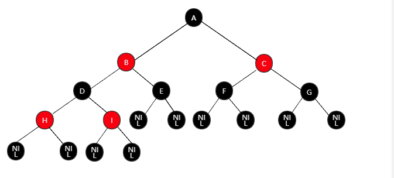

# 红黑树

## 特性：

- 节点是红色或黑色

- 根节点一定是黑色

- 每个叶子节点都是黑色的空节点（NIL节点）

- 每个红节点的两个子节点都是黑色的（除了NIL节点，红黑节点是交替的）



红黑树默认插入节点为红节点

# 左旋
```java
/**
*HashMap中的左旋源码
*/
static <K,V> TreeNode<K,V> rotateLeft(TreeNode<K,V> root,TreeNode<K,V> p) {
    TreeNode<K,V> r, pp, rl;
    if (p != null && (r = p.right) != null) {
        if ((rl = p.right = r.left) != null)
            rl.parent = p;
        if ((pp = r.parent = p.parent) == null)
            (root = r).red = false;
        else if (pp.left == p)
            pp.left = r;
        else
            pp.right = r;
        r.left = p;
        p.parent = r;
    }
    return root;
}
```