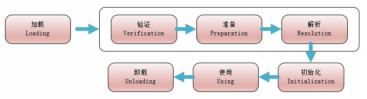

# 类的生命周期

*验证、准备、解析*称为链接

*当程序主动使用某个类时，如果该类还未被加载到内存中，则JVM会通过加载、连接、初始化3个步骤来对该类进行初始化。*

# 触发类加载的条件：
- 遇到new,getstatic,putstatic或invokestatic这4条字节码指令时，如果类没有进行过初始化，则需要先触发初始化。生成这4条指令的最常见的Java代码场景是：使用new关键字实例化对象的时候，读取或设置一个类的静态字段的时候（被final修饰，已在编译期把结果放入常量池的静态字段除外），以及调用一个类的静态方法的时候。

- 使用java.lang.reflect包的方法对类进行反射调用的时候。

- 当初始化一个类的时候，发现其父类还没有进行过初始化，则需要先出发父类的初始化。

- 当虚拟机启动时，用户需要指定一个要执行的主类（包含main()方法的那个类），虚拟机会先初始化这个主类。

- 当使用JDK1.7的动态语言支持时，如果一个java.lang.invoke.MethodHandle实例最后的解析结果REF_getStatic,REF_putStatic,REF_invokeStatic的方法句柄，并且这个方法句柄所对应的类没有进行初始化，则需要先出发初始化。

# 类加载过程

## 加载

加载指的是将类的class文件读入到内存，并为之创建一个java.lang.Class对象，也就是说，当程序中使用任何类时，系统都会为之建立一个java.lang.Class对象。

类的加载由类加载器完成，类加载器通常由JVM提供，这些类加载器也是前面所有程序运行的基础，JVM提供的这些类加载器通常被称为系统类加载器。除此之外，开发者可以通过继承ClassLoader基类来创建自己的类加载器。

1. 通过一个类的全限定名来获取定义此类的二进制字节流
2. 将这个字节流所代表的静态存储结构转换为方法区内的运行时数据结构
3. 在内存中生成一个代表这个类的java.lang.Class对象，作为方法区这个类的各种数据的访问入口。

## 验证

是链接阶段的第一步，目的是为了确保Class文件的字节流中包含的信息符合当前虚拟机的要求，并且不会危害虚拟机自身的安全。

其主要包括四种验证，文件格式验证，元数据验证，字节码验证，符号引用验证：

**文件格式验证**

    验证字节流是否符合Class文件格式的规范，并且能被当前版本的虚拟机处理。

**元数据验证**

    对类的元数据信息进行语义校验，是否不存在不符合Java语言规范的元数据信息

**字节码验证**

    最复杂的一个阶段，主要目的是通过数据流和控制流分析，确定程序语义是合法的，符合逻辑的。对类的方法体进行校验分析，保证被校验类的方法在运行时不会做出危害虚拟机安全的事件。

**符号引用验证**

    最后一个阶段的校验发生在虚拟机将符号引用转换为直接引用的时候，这个转换动作将在连接的第三个阶段——解析阶段中发生。
    符号验证的目的是确保解析动作能正常进行。主要是针对符号引用转换为直接引用的时候，是会延伸到第三解析阶段，主要去确定访问类型等涉及到引用的情况，主要是要保证引用一定会被访问到，不会出现类等无法访问的问题。

**准备**

    准备阶段是正式为类变量（静态变量）分配内存并设置类变量初始值的阶段。这些变量所使用的内存都将在方法区中分配。只包括类变量。

**解析**

    虚拟机将常量池内的符号引用替换为直接引用的过程。

*符号引用：符号引用是以一组符号来描述所引用的目标，符号可以是任何的字面形式的字面量，只要不会出现冲突能够定位到就行。布局和内存无关。直接引用：是指向目标的指针，偏移量或者能够直接定位的句柄。该引用是和内存中的布局有关的，并且一定加载进来的。*

    “动态解析”的含义就是必须等到程序实际运行到这条指令的时候，解析动作才能进行。相对的，其余可触发解析的指令都是“静态”的，可以在刚刚完成加载阶段，还没有开始执行代码时就进行解析。

**初始化**

    类加载过程中的最后一步。初始化是为类的静态变量赋予正确的初始值。

    初始化阶段是执行类构造器<\clinit>()方法的过程。

    <\clinit>()方法是由编译器自动收集类中的所有类变量的赋值动作和静态语句块中的语句合并产生的。

    <\clinit>()与类的构造函数不同，它不需要显示地调用父类构造器，虚拟机会保证在子类的<\clinit>()方法执行之前，父类的<\clinit>()方法已经执行完毕。

    简单地说，初始化就是对类变量进行赋值及执行静态代码块