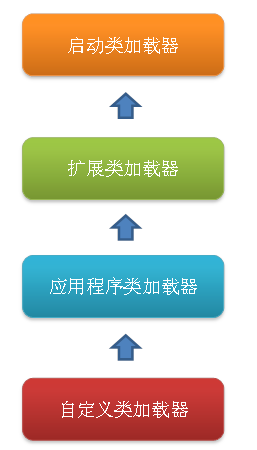

# 类加载器
类加载器负责加载所有的类，其为所有被载入内存中的类生成一个java.lang.Class实例对象。一旦一个类被加载如JVM中，同一个类就不会被再次载入了。正如一个对象有一个唯一的标识一样，一个载入JVM的类也有一个唯一的标识。在Java中，一个类用其全限定类名（包括包名和类名）作为标识；但在JVM中，一个类用其全限定类名和其类加载器作为其唯一标识。

# 类加载器分类

## 引导类加载器（Bootstrap ClassLoader）
它用来加载 Java 的核心类，(由C++语言实现（针对HotSpot），并不继承自 java.lang.ClassLoader（负责加载$JAVA_HOME中jre/lib/rt.jar里所有的class，由C++实现，不是ClassLoader子类）。

## 扩展类加载器（Extension ClassLoader）
负责加载\lib\ext目录或java.ext.dirs系统变量指定的路径中的所有类库，即负责加载Java扩展的核心类之外的类。由Java语言实现，父类加载器为null。

## 应用程序类加载器（Application ClassLoader）：
负责加载用户类路径（classpath）上的指定类库，我们可以直接使用这个类加载器，通过ClassLoader.getSystemClassLoader()方法直接获取。一般情况，如果我们没有自定义类加载器默认就是用这个加载器。由Java语言实现，父类加载器为ExtClassLoader。

## 类加载器加载Class大致要经过如下8个步骤：
1. 检测此Class是否载入过，即在缓冲区中是否有此Class，如果有直接进入第8步，否则进入第2步。
2. 如果没有父类加载器，则要么Parent是根类加载器，要么本身就是根类加载器，则跳到第4步，如果父类加载器存在，则进入第3步。
3. 请求使用父类加载器去载入目标类，如果载入成功则跳至第8步，否则接着执行第5步。
4. 请求使用根类加载器去载入目标类，如果载入成功则跳至第8步，否则跳至第7步。
5. 当前类加载器尝试寻找Class文件，如果找到则执行第6步，如果找不到则执行第7步。
6. 从文件中载入Class，成功后跳至第8步。
7. 抛出ClassNotFountException异常。
8. 返回对应的java.lang.Class对象。

# 类加载机制
- 全盘负责：所谓全盘负责，就是当一个类加载器负责加载某个Class时，该Class所依赖和引用其他Class也将由该类加载器负责载入，除非显示使用另外一个类加载器来载入。

- 双亲委派：所谓的双亲委派，则是先让父类加载器试图加载该Class，只有在父类加载器无法加载该类时才尝试从自己的类路径中加载该类。通俗的讲，就是某个特定的类加载器在接到加载类的请求时，首先将加载任务委托给父加载器，依次递归，如果父加载器可以完成类加载任务，就成功返回；只有父加载器无法完成此加载任务时，才自己去加载。

- 缓存机制。缓存机制将会保证所有加载过的Class都会被缓存，当程序中需要使用某个Class时，类加载器先从缓存区中搜寻该Class，只有当缓存区中不存在该Class对象时，系统才会读取该类对应的二进制数据，并将其转换成Class对象，存入缓冲区中。这就是为什么修改了Class后，必须重新启动JVM，程序所做的修改才会生效的原因。

## 双亲委派模型

*这样的好处是不同层次的类加载器具有不同优先级，比如所有Java对象的超级父类java.lang.Object，位于rt.jar，无论哪个类加载器加载该类，最终都是由引导类加载器进行加载，保证安全。即使用户自己编写一个java.lang.Object类并放入程序中，虽能正常编译，但不会被加载运行，保证不会出现混乱。*
