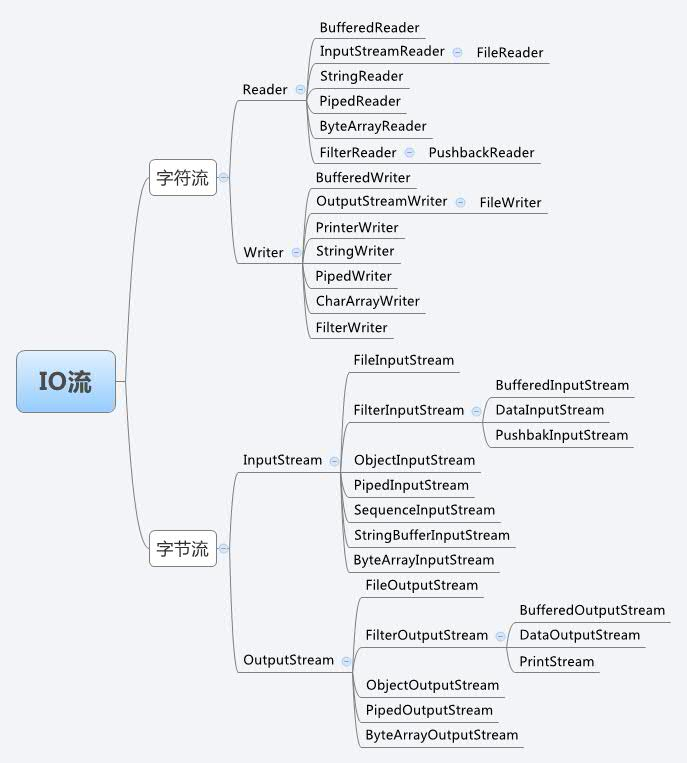

# 字符与字节
在Java中有输入、输出两种IO流，每种输入、输出流又分为字节流和字符流两大类。关于字节，我们在学习8大基本数据类型中都有了解，每个字节(byte)有8bit组成，每种数据类型又几个字节组成等。关于字符，我们可能知道代表一个汉字或者英文字母。

## 字节与字符之间的关系
Java采用unicode编码，2个字节来表示一个字符，这点与C语言中不同，C语言中采用ASCII，在大多数系统中，一个字符通常占1个字节，但是在0~127整数之间的字符映射，unicode向下兼容ASCII。**而Java采用unicode来表示字符，一个中文或英文字符的unicode编码都占2个字节。**但如果采用其他编码方式，一个字符占用的字节数则各不相同。

# File类
File类是java.io包下代表与平台无关的文件和目录，也就是说，如果希望在程序中操作文件和目录，都可以通过File类来完成。

## 构造函数
```java
//构造函数File(String pathname)
File f1 =new File("c:\\abc\\1.txt");
//File(String parent,String child)
File f2 =new File("c:\\abc","2.txt");
//File(File parent,String child)
File f3 =new File("c:"+File.separator+"abc");//separator 跨平台分隔符
File f4 =new File(f3,"3.txt");
System.out.println(f1);//c:\abc\1.txt
```

## 路径分隔符：
windows： "/" "\" 都可以

linux/unix： "/" 

注意:如果windows选择用"\"做分割符的话,那么请记得替换成"\",因为Java中"\"代表转义字符
所以推荐都使用"/"，也可以直接使用代码File.separator，表示跨平台分隔符。

## 路径：
- 相对路径：

./表示当前路径

../表示上一级路径

其中当前路径：默认情况下，java.io 包中的类总是根据当前用户目录来分析相对路径名。此目录由系统属性 user.dir 指定，通常是 Java 虚拟机的调用目录。”

- 绝对路径：

绝对路径名是完整的路径名，不需要任何其他信息就可以定位自身表示的文件

## 创建与删除方法
```java
//如果文件存在返回false，否则返回true并且创建文件 
boolean createNewFile();
//创建一个File对象所对应的目录，成功返回true，否则false。且File对象必须为路径而不是文件。只会创建最后一级目录，如果上级目录不存在就抛异常。
boolean mkdir();
//创建一个File对象所对应的目录，成功返回true，否则false。且File对象必须为路径而不是文件。创建多级目录，创建路径中所有不存在的目录
boolean mkdirs()    ;
//如果文件存在返回true并且删除文件，否则返回false
boolean delete();
//在虚拟机终止时，删除File对象所表示的文件或目录。
void deleteOnExit();
```

## 判断方法
```java
boolean canExecute()    ;//判断文件是否可执行
boolean canRead();//判断文件是否可读
boolean canWrite();//判断文件是否可写
boolean exists();//判断文件是否存在
boolean isDirectory();//判断是否是目录
boolean isFile();//判断是否是文件
boolean isHidden();//判断是否是隐藏文件或隐藏目录
boolean isAbsolute();//判断是否是绝对路径 文件不存在也能判断
```

## 获取方法
```java
String getName();//返回文件或者是目录的名称
String getPath();//返回路径
String getAbsolutePath();//返回绝对路径
String getParent();//返回父目录，如果没有父目录则返回null
long lastModified();//返回最后一次修改的时间
long length();//返回文件的长度
File[] listRoots();// 列出所有的根目录（Window中就是所有系统的盘符）
String[] list() ;//返回一个字符串数组，给定路径下的文件或目录名称字符串
String[] list(FilenameFilter filter);//返回满足过滤器要求的一个字符串数组
File[]  listFiles();//返回一个文件对象数组，给定路径下文件或目录
File[] listFiles(FilenameFilter filter);//返回满足过滤器要求的一个文件对象数组
```
其中包含了一个重要的接口FileNameFilter，该接口是个文件过滤器，包含了一个accept(File dir,String name)方法，该方法依次对指定File的所有子目录或者文件进行迭代，按照指定条件，进行过滤，过滤出满足条件的所有文件。
```java
// 文件过滤
File[] files = file.listFiles(new FilenameFilter() {
    @Override
    public boolean accept(File file, String filename) {
        return filename.endsWith(".mp3");
    }
});
```

# IO流
在Java中把不同的输入/输出源抽象表述为"流"。流是一组有顺序的，有起点和终点的字节集合，是对数据传输的总称或抽象。即数据在两设备间的传输称为流，流的本质是数据传输，根据数据传输特性将流抽象为各种类，方便更直观的进行数据操作。

**流有输入和输出，输入时是流从数据源流向程序。输出时是流从程序传向数据源，而数据源可以是内存，文件，网络或程序等。**

# IO流的分类
## 输入流和输出流
- 输入流:只能从中读取数据，而不能向其写入数据。

- 输出流:只能向其写入数据，而不能从中读取数据。

## 字节流和字符流
字节流和字符流和用法几乎完全一样，区别在于字节流和字符流所操作的数据单元不同。

字符流的由来： 因为数据编码的不同，而有了对字符进行高效操作的流对象。本质其实就是基于字节流读取时，去查了指定的码表。字节流和字符流的区别：

1. 读写单位不同：字节流以字节（8bit）为单位，字符流以字符为单位，根据码表映射字符，一次可能读多个字节。

2. 处理对象不同：字节流能处理所有类型的数据（如图片、avi等），而字符流只能处理字符类型的数据。

只要是处理纯文本数据，就优先考虑使用字符流。 除此之外都使用字节流。

## 节点流和处理流
可以从/向一个特定的IO设备（如磁盘、网络）读/写数据的流，称为节点流，节点流也被成为低级流。

处理流是对一个已存在的流进行连接或封装，通过封装后的流来实现数据读/写功能，处理流也被称为高级流。

```java
//节点流，直接传入的参数是IO设备
FileInputStream fis = new FileInputStream("test.txt");
//处理流，直接传入的参数是流对象
BufferedInputStream bis = new BufferedInputStream(fis);
```

当使用处理流进行输入/输出时，程序并不会直接连接到实际的数据源，没有和实际的输入/输出节点连接。使用处理流的一个明显好处是，只要使用相同的处理流，程序就可以采用完全相同的输入/输出代码来访问不同的数据源，随着处理流所包装节点流的变化，程序实际所访问的数据源也相应地发生变化。
实际上，Java使用处理流来包装节点流是一种典型的装饰器设计模式，通过使用处理流来包装不同的节点流，既可以消除不同节点流的实现差异，也可以提供更方便的方法来完成输入/输出功能。

# IO流的四大基类 


## InputStream
InputStream 是所有的输入字节流的父类，它是一个抽象类，主要包含三个方法：
```java
//读取一个字节并以整数的形式返回(0~255),如果返回-1已到输入流的末尾。 
int read(); 
//读取一系列字节并存储到一个数组buffer，返回实际读取的字节数，如果读取前已到输入流的末尾返回-1。 
int read(byte[] buffer); 
//读取length个字节并存储到一个字节数组buffer，从off位置开始存,最多len， 返回实际读取的字节数，如果读取前以到输入流的末尾返回-1。 
int read(byte[] buffer, int off, int len);
```

## Reader
Reader 是所有的输入字符流的父类，它是一个抽象类，主要包含三个方法：
```java
//读取一个字符并以整数的形式返回(0~255),如果返回-1已到输入流的末尾。 
int read() 
//读取一系列字符并存储到一个数组buffer，返回实际读取的字符数，如果读取前已到输入流的末尾返回-1。 
int read(char[] cbuf)
//读取length个字符,并存储到一个数组buffer，从off位置开始存,最多读取len，返回实际读取的字符数，如果读取前以到输入流的末尾返回-1。 
int read(char[] cbuf, int off, int len)
```

**在执行完流操作后，要调用close()方法来关闭输入流，因为程序里打开的IO资源不属于内存资源，垃圾回收机制无法回收该资源，所以应该显式关闭文件IO资源。**

InputStream和Reader还支持如下方法来移动流中的指针位置：
```java
//在此输入流中标记当前的位置
//readlimit - 在标记位置失效前可以读取字节的最大限制。
void mark(int readlimit)
// 测试此输入流是否支持 mark 方法
boolean markSupported()
// 跳过和丢弃此输入流中数据的 n 个字节/字符
long skip(long n)
//将此流重新定位到最后一次对此输入流调用 mark 方法时的位置
void reset()
```

## OutputStream
OutputStream 是所有的输出字节流的父类，它是一个抽象类，主要包含如下四个方法：
```java
//向输出流中写入一个字节数据,该字节数据为参数b的低8位。 
void write(int b) ; 
//将一个字节类型的数组中的数据写入输出流。 
void write(byte[] b); 
//将一个字节类型的数组中的从指定位置（off）开始的,len个字节写入到输出流。 
void write(byte[] b, int off, int len); 
//将输出流中缓冲的数据全部写出到目的地。 
void flush();
```

## Writer
Writer 是所有的输出字符流的父类，它是一个抽象类,主要包含如下六个方法：
```java
//向输出流中写入一个字符数据,该字节数据为参数b的低16位。 
void write(int c); 
//将一个字符类型的数组中的数据写入输出流， 
void write(char[] cbuf) 
//将一个字符类型的数组中的从指定位置（offset）开始的,length个字符写入到输出流。 
void write(char[] cbuf, int offset, int length); 
//将一个字符串中的字符写入到输出流。 
void write(String string); 
//将一个字符串从offset开始的length个字符写入到输出流。 
void write(String string, int offset, int length); 
//将输出流中缓冲的数据全部写出到目的地。 
void flush()
```

**使用Java的IO流执行输出时，不要忘记关闭输出流，关闭输出流除了可以保证流的物理资源被回收之外，还能将输出流缓冲区的数据flush到物理节点里（因为在执行close()方法之前，自动执行输出流的flush()方法）**