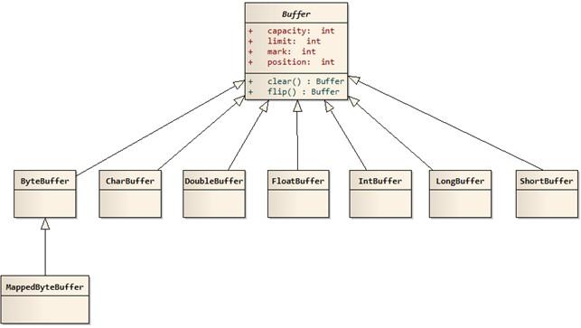

# Java NIO
Java NIO是一种新式的IO标准，与普通IO的工作方式不同。标准的IO基于字节流和字符流进行操作的，而NIO是基于通道(Channel)和缓冲区(Buffer)进行操作，数据总是从通道读取到缓冲区中，或者从缓冲区写入通道。

**由上面的定义就说明NIO是一种新型的IO，但NIO不仅仅就是等于Non-blocking IO（非阻塞IO），NIO中有实现非阻塞IO的具体类，但不代表NIO就是Non-blocking IO（非阻塞IO）。**

Java NIO 由以下几个核心部分组成：

- Buffer
- Channel
- Selector

传统的IO操作面向数据流，意味着每次从流中读一个或多个字节，直至完成，数据没有被缓存在任何地方。NIO操作面向缓冲区，数据从Channel读取到Buffer缓冲区，随后在Buffer中处理数据。

# Buffer
## 利用Buffer读写数据，通常遵循四个步骤：
1. 把数据写入buffer；
2. 调用flip；
3. 从Buffer中读取数据；
4. 调用buffer.clear()

当写入数据到buffer中时，buffer会记录已经写入的数据大小。当需要读数据时，通过flip()方法把buffer从写模式调整为读模式；在读模式下，可以读取所有已经写入的数据。

当读取完数据后，需要清空buffer，以满足后续写入操作。清空buffer有两种方式：调用clear()，一旦读完Buffer中的数据，需要让Buffer准备好再次被写入，clear会恢复状态值，但不会擦除数据。

## Buffer的容量，位置，上限（Buffer Capacity, Position and Limit)
buffer缓冲区实质上就是一块内存，用于写入数据，也供后续再次读取数据。这块内存被NIO Buffer管理，并提供一系列的方法用于更简单的操作这块内存。

一个Buffer有三个属性是必须掌握的，分别是：

- capacity容量

    作为一块内存，buffer有一个固定的大小，叫做capacity容量。也就是最多只能写入容量值得字节，整形等数据。一旦buffer写满了就需要清空已读数据以便下次继续写入新的数据。

- position位置

    当写入数据到Buffer的时候需要中一个确定的位置开始，默认初始化时这个位置position为0，一旦写入了数据比如一个字节，整形数据，那么position的值就会指向数据之后的一个单元，position最大可以到capacity-1。

    当从Buffer读取数据时，也需要从一个确定的位置开始。buffer从写入模式变为读取模式时，position会归零，每次读取后，position向后移动。

- limit限制

    在写模式，limit的含义是我们所能写入的最大数据量。它等同于buffer的容量。

    一旦切换到读模式，limit则代表我们所能读取的最大数据量，他的值等同于写模式下position的位置。
    
    数据读取的上限时buffer中已有的数据，也就是limit的位置（原position所指的位置）

## 分配一个Buffer（Allocating a Buffer）
为了获取一个Buffer对象，你必须先分配。每个Buffer实现类都有一个allocate()方法用于分配内存。下面看一个实例,开辟一个48字节大小的buffer：
```java
ByteBuffer buf = ByteBuffer.allocate(48);
```

开辟一个1024个字符的CharBuffer：
```java
CharBuffer buf = CharBuffer.allocate(1024);
```

## Buffer实现类

其中MappedByteBuffer比较特殊。Java类库中的NIO包相对于IO 包来说有一个新功能是内存映射文件，日常编程中并不是经常用到，但是在处理大文件时是比较理想的提高效率的手段。其中MappedByteBuffer实现的就是内存映射文件，可以实现大文件的高效读写。

# Channel的使用
Java NIO Channel通道和流非常相似，主要有以下几点区别：

- 通道可以读也可以写，流一般来说是单向的（只能读或者写）。

- 通道可以异步读写。

- 通道总是基于缓冲区Buffer来读写。

- 我们可以从通道中读取数据，写入到buffer；也可以中buffer内读数据，写入到通道中。

## Channel的实现类有：
- FileChannel  

    用于文件的数据读写

- DatagramChannel

    用于UDP的数据读写

- SocketChannel

    用于TCP的数据读写

- ServerSocketChannel

    允许我们监听TCP链接请求，每个请求会创建一个SocketChannel


## Demo:
```JAVA
RandomAccessFile aFile = new RandomAccessFile("data/nio-data.txt", "rw");
FileChannel inChannel = aFile.getChannel();
ByteBuffer buf = ByteBuffer.allocate(48);int bytesRead = inChannel.read(buf);
while (bytesRead != -1) {
    System.out.println("Read " + bytesRead);
    buf.flip();  
    while(buf.hasRemaining()){
        System.out.print((char) buf.get());
    }  
    buf.clear();
    bytesRead = inChannel.read(buf);
}
aFile.close();
```

# NIO中的blocking IO/nonblocking IO/IO multiplexing/asynchronous IO
首先，标准的IO显然属于blocking IO。

其次，NIO中的实现了SelectableChannel类的对象，可以通过如下方法设置是否支持非阻塞模式：

SelectableChannel configureBlocking(boolean block)：调整此通道的阻塞模式。

如果为 true，则此通道将被置于阻塞模式；如果为 false，则此通道将被置于非阻塞模式
设置为false的NIO类将是nonblocking IO。

再其次，通过Selector监听实现多个NIO对象的读写操作，显然属于IO multiplexing。关于Selector，其负责调度多个非阻塞式IO，当有其感兴趣的读写操作到来时，再执行相应的操作。Selector执行select()方法来进行轮询查找是否到来了读写操作，这个过程是阻塞的。

# Selector使用
Selector是Java NIO中的一个组件，用于检查一个或多个NIO Channel的状态是否处于可读、可写。如此可以实现单线程管理多个channels,也就是可以管理多个网络链接。

Selector是一种IO multiplexing的情况。

## 创建Selector(Creating a Selector)。创建一个Selector可以通过Selector.open()方法：
```java
Selector selector = Selector.open();
```

## 注册Channel到Selector上
```java
channel.configureBlocking(false);
SelectionKey key = channel.register(selector, SelectionKey.OP_READ);
```

Channel必须是非阻塞的。上面对IO multiplexing的图解中可以看出。所以FileChannel不适用Selector，因为FileChannel不能切换为非阻塞模式。Socket channel可以正常使用。

**注意register的第二个参数，这个参数是一个“关注集合”，代表我们关注的channel状态，有四种基础类型可供监听：**
- Connect
- Accept
- Read
- Write

一个channel触发了一个事件也可视作该事件处于就绪状态。

因此当channel与server连接成功后，那么就是“Connetct”状态。server channel接收请求连接时处于“Accept”状态。channel有数据可读时处于“Read”状态。channel可以进行数据写入时处于“Writer”状态。当注册到Selector的所有Channel注册完后，调用Selector的select()方法，将会不断轮询检查是否有以上设置的状态产生，如果产生便会加入到SelectionKey集合中，进行后续操作。

上述的四种就绪状态用SelectionKey中的常量表示如下：
```java
SelectionKey.OP_CONNECT
SelectionKey.OP_ACCEPT
SelectionKey.OP_READ
SelectionKey.OP_WRITE
```
如果对多个事件感兴趣可利用位的或运算结合多个常量，比如：
```java
int interestSet = SelectionKey.OP_READ | SelectionKey.OP_WRITE;
```

## 从Selector中选择channel(Selecting Channels via a Selector)
一旦我们向Selector注册了一个或多个channel后，就可以调用select来获取channel。select方法会返回所有处于就绪状态的channel。

select方法具体如下：
- int select()

    select()方法在返回channel之前处于阻塞状态。 
    select(long timeout)和select做的事一样，不过他的阻塞有一个超时限制。
    返回值是一个int整形，代表有多少channel处于就绪了。也就是自上一次select后有多少channel进入就绪。

- int select(long timeout)

- int selectNow()

    selectNow()不会阻塞，根据当前状态立刻返回合适的channel。

## selectedKeys()
在调用select并返回了有channel就绪之后，可以通过选中的key集合来获取channel，这个操作通过调用selectedKeys()方法：

```java
Set<SelectionKey> selectedKeys = selector.selectedKeys();
```

遍历这些SelectionKey可以通过如下方法：
```java
Set<SelectionKey> selectedKeys = selector.selectedKeys();

Iterator<SelectionKey> keyIterator = selectedKeys.iterator();

while(keyIterator.hasNext()) {

    SelectionKey key = keyIterator.next();

    if(key.isAcceptable()) {
        // a connection was accepted by a ServerSocketChannel.

    } else if (key.isConnectable()) {
        // a connection was established with a remote server.

    } else if (key.isReadable()) {
        // a channel is ready for reading

    } else if (key.isWritable()) {
        // a channel is ready for writing
    }

    keyIterator.remove();
}
```

## wakeUp()
由于调用select而被阻塞的线程，可以通过调用Selector.wakeup()来唤醒即便此时已然没有channel处于就绪状态。具体操作是，在另外一个线程调用wakeup，被阻塞与select方法的线程就会立刻返回。

## close()
当操作Selector完毕后，需要调用close方法。close的调用会关闭Selector并使相关的SelectionKey都无效。channel本身不管被关闭。

# 完整的Selector案例
```java
Selector selector = Selector.open();

channel.configureBlocking(false);

SelectionKey key = channel.register(selector, SelectionKey.OP_READ);

while(true) {

    int readyChannels = selector.select();  
    if(readyChannels == 0) continue;    
    Set<SelectionKey> selectedKeys = selector.selectedKeys();   
    Iterator<SelectionKey> keyIterator = selectedKeys.iterator();   
    while(keyIterator.hasNext()) {  
      SelectionKey key = keyIterator.next();    
      if(key.isAcceptable()) {
          // a connection was accepted by a ServerSocketChannel.    
      } else if (key.isConnectable()) {
          // a connection was established with a remote server. 
      } else if (key.isReadable()) {
          // a channel is ready for reading 
      } else if (key.isWritable()) {
          // a channel is ready for writing
      } 
      keyIterator.remove();
    }
}
```