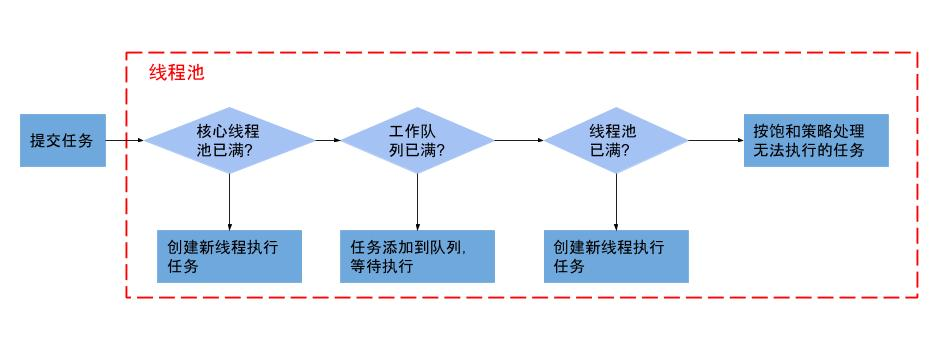

# ThreadPoolExecutor
## 创建线程
```java
ExecutorService service = new ThreadPoolExecutor(....);
```

## 构造方法
```java
public ThreadPoolExecutor(int corePoolSize,
                          int maximumPoolSize,
                          long keepAliveTime,
                          TimeUnit unit,
                          BlockingQueue<Runnable> workQueue) {
    this(corePoolSize, maximumPoolSize, keepAliveTime, unit, workQueue,
         Executors.defaultThreadFactory(), defaultHandler);
}
```

## ThreadPoolExecutor参数含义
- corePoolSize
    
    线程池中核心线程数，默认情况下，核心线程一直存活在线程池中，即便他们在线程池中处于闲置状态。除非我们将ThreadPoolExecutor的allowCoreThreadTimeOut属性设为true的时候，这时候处于闲置的核心线程在等待新任务到来时会有超时策略，这个超时时间由keepAliveTime来指定。一旦超过所设置的超时时间，闲置的核心线程就会被终止。

- maximumPoolSize

    线程池中所容纳的最大线程数，如果活动的线程达到这个数值以后，后续的新任务将会被阻塞。包含核心线程数+非核心线程数。

- keepAliveTime

    非核心线程闲置时的超时时长，对于非核心线程，闲置时间超过这个时间，非核心线程就会被回收。只有对ThreadPoolExecutor的allowCoreThreadTimeOut属性设为true的时候，这个超时时间才会对核心线程产生效果。

- unit

    用于指定keepAliveTime参数的时间单位。他是一个枚举，可以使用的单位有天（TimeUnit.DAYS），小时（TimeUnit.HOURS），分钟（TimeUnit.MINUTES），毫秒(TimeUnit.MILLISECONDS)，微秒(TimeUnit.MICROSECONDS, 千分之一毫秒)和毫微秒(TimeUnit.NANOSECONDS, 千分之一微秒);

- workQueue

    线程池中保存等待执行的任务的阻塞队列。通过线程池中的execute方法提交的Runable对象都会存储在该队列中。我们可以选择下面几个阻塞队列。

    |阻塞队列|说明|
    |-|-|
    |ArrayBlockingQueue|基于数组实现的有界的阻塞队列,该队列按照FIFO（先进先出）原则对队列中的元素进行排序。|
    |LinkedBlockingQueue|基于链表实现的阻塞队列，该队列按照FIFO（先进先出）原则对队列中的元素进行排序。|
    |SynchronousQueue|内部没有任何容量的阻塞队列。在它内部没有任何的缓存空间。对于SynchronousQueue中的数据元素只有当我们试着取走的时候才可能存在。|
    |PriorityBlockingQueue|具有优先级的无限阻塞队列。|

    我们还能够通过实现BlockingQueue接口来自定义我们所需要的阻塞队列。

- threadFactory

    线程工厂，为线程池提供新线程的创建。ThreadFactory是一个接口，里面只有一个new Thread方法。 默认为DefaultThreadFactory类。

- handler

    是RejectedExecutionHandler对象，而RejectedExecutionHandler是一个接口，里面只有一个rejectedExecution方法。当任务队列已满并且线程池中的活动线程已经达到所限定的最大值或者是无法成功执行任务，这时候ThreadPoolExecutor会调用RejectedExecutionHandler中的rejectedExecution方法。在ThreadPoolExecutor中有四个内部类实现了RejectedExecutionHandler接口。在线程池中它默认是AbortPolicy，在无法处理新任务时抛出RejectedExecutionException异常。

    下面是在ThreadPoolExecutor中提供的四个可选值。

    |可选值|说明|
    |-|-|
    |CallerRunsPolicy|只用调用者所在线程来运行任务|
    |AbortPolicy|直接抛出RejectedExecutionException异常|
    |DiscardPolicy|丢弃掉该任务，不进行处理|
    |DiscardOldestPolicy|丢弃队列里最近的一个任务，并执行当前任务|

    我们也可以通过实现RejectedExecutionHandler接口来自定义我们自己的handler。如记录日志或持久化不能处理的任务。

## 提交任务
可以通过execute和submit两种方式来向线程池提交一个任务。

- execute 
    
    当我们使用execute来提交任务时，由于execute方法没有返回值，所以说我们也就无法判定任务是否被线程池执行成功。

- submit

    当我们使用submit来提交任务时,它会返回一个future,我们就可以通过这个future来判断任务是否执行成功，还可以通过future的get方法来获取返回值。如果子线程任务没有完成，get方法会阻塞住直到任务完成，而使用get(long timeout, TimeUnit unit)方法则会阻塞一段时间后立即返回，这时候有可能任务并没有执行完。

    ```java
    Future<Integer> future = service.submit(new Callable<Integer>() {

        @Override
        public Integer call() throws Exception {
            System.out.println("submit方式");
            return 2;
        }
    });

    try {
        Integer number = future.get();
    } catch (ExecutionException e) {
        // TODO Auto-generated catch block
        e.printStackTrace();
    }
    ```

## 线程池关闭

    调用线程池的shutdown()或shutdownNow()方法来关闭线程池
    
    shutdown原理：将线程池状态设置成SHUTDOWN状态，然后中断所有没有正在执行任务的线程。

    shutdownNow原理：将线程池的状态设置成STOP状态，然后中断所有任务(包括正在执行的)的线程，并返回等待执行任务的列表。

    中断采用interrupt方法，所以无法响应中断的任务可能永远无法终止。 但调用上述的两个关闭之一，isShutdown()方法返回值为true，当所有任务都已关闭，表示线程池关闭完成，则isTerminated()方法返回值为true。当需要立刻中断所有的线程，不一定需要执行完任务，可直接调用shutdownNow()方法。

# 线程池执行流程



- 如果在线程池中的线程数量没有达到核心的线程数量，这时候就回启动一个核心线程来执行任务。

- 如果线程池中的线程数量已经超过核心线程数，这时候任务就会被插入到任务队列中排队等待执行。

- 由于任务队列已满，无法将任务插入到任务队列中。这个时候如果线程池中的线程数量没有达到线程池所设定的最大值，那么这时候就会立即启动一个非核心线程来执行任务。

- 如果线程池中的数量达到了所规定的最大值，那么就会拒绝执行此任务，这时候就会调用RejectedExecutionHandler中的rejectedExecution方法来通知调用者。

# 总结

线程池本质是一个hashSet。多余的任务会放在阻塞队列中。

只有当阻塞队列满了后，才会触发非核心线程的创建。所以非核心线程只是临时过来打杂的。直到空闲了，然后自己关闭了。

线程池提供了两个钩子(beforeExecute，afterExecute)给我们，我们继承线程池，在执行任务前后做一些事情。

线程池原理关键技术：锁(lock,cas)、阻塞队列、hashSet(资源池)

# 四种线程池类
## newFixedThreadPool
通过Executors中的newFixedThreadPool方法来创建，该线程池是一种**线程数量固定的线程池**。
```java
ExecutorService service = Executors.newFixedThreadPool(4);
```
在这个线程池中 所容纳最大的线程数就是我们设置的核心线程数。 如果线程池的线程处于空闲状态的话，它们并不会被回收，除非是这个线程池被关闭。如果所有的线程都处于活动状态的话，新任务就会处于等待状态，直到有线程空闲出来。

由于newFixedThreadPool只有核心线程，并且这些线程都不会被回收，也就是 它能够更快速的响应外界请求 。从下面的newFixedThreadPool方法的实现可以看出，newFixedThreadPool只有核心线程，并且不存在超时机制，采用LinkedBlockingQueue，所以对于任务队列的大小也是没有限制的。
```java
public static ExecutorService newFixedThreadPool(int nThreads) {
    return new ThreadPoolExecutor(nThreads, nThreads,
        0L, TimeUnit.MILLISECONDS,
        new LinkedBlockingQueue<Runnable>());
}
```

## newCachedThreadPool
通过Executors中的newCachedThreadPool方法来创建。
```java
public static ExecutorService newCachedThreadPool() {
    return new ThreadPoolExecutor(0, Integer.MAX_VALUE,
        60L, TimeUnit.SECONDS,
        new SynchronousQueue<Runnable>());
}
```

通过上面的newCachedThreadPool方法在这里我们可以看出它的**核心线程数为0， 线程池的最大线程数Integer.MAX_VALUE。**而Integer.MAX_VALUE是一个很大的数，也差不多可以说 这个线程池中的最大线程数可以任意大。

当线程池中的线程都处于活动状态的时候，线程池就会创建一个新的线程来处理任务。该线程池中的线程超时时长为60秒，所以当线程处于闲置状态超过60秒的时候便会被回收。 这也就意味着若是整个线程池的线程都处于闲置状态超过60秒以后，在newCachedThreadPool线程池中是不存在任何线程的，所以这时候它几乎不占用任何的系统资源。

对于newCachedThreadPool他的任务队列采用的是SynchronousQueue，上面说到在SynchronousQueue内部没有任何容量的阻塞队列。SynchronousQueue内部相当于一个空集合，我们无法将一个任务插入到SynchronousQueue中。所以说在线程池中如果现有线程无法接收任务,将会创建新的线程来执行任务。

## newScheduledThreadPool
通过Executors中的newScheduledThreadPool方法来创建。
```java
public static ScheduledExecutorService newScheduledThreadPool(int corePoolSize) {
    return new ScheduledThreadPoolExecutor(corePoolSize);
}
public ScheduledThreadPoolExecutor(int corePoolSize) {
    super(corePoolSize, Integer.MAX_VALUE, 0, NANOSECONDS,
          new DelayedWorkQueue());
}
```
它的**核心线程数是固定的，对于非核心线程几乎可以说是没有限制的**，并且当非核心线程处于限制状态的时候就会立即被回收。

创建一个可定时执行或周期执行任务的线程池：
```java
ScheduledExecutorService service = Executors.newScheduledThreadPool(4);
service.schedule(new Runnable() {
    public void run() {
        System.out.println(Thread.currentThread().getName()+"延迟三秒执行");
    }
}, 3, TimeUnit.SECONDS);
service.scheduleAtFixedRate(new Runnable() {
    public void run() {
        System.out.println(Thread.currentThread().getName()+"延迟三秒后每隔2秒执行");
    }
}, 3, 2, TimeUnit.SECONDS);
```

```
schedule(Runnable command, long delay, TimeUnit unit)：延迟一定时间后执行Runnable任务；

schedule(Callable callable, long delay, TimeUnit unit)：延迟一定时间后执行Callable任务；

scheduleAtFixedRate(Runnable command, long initialDelay, long period, TimeUnit unit)：延迟一定时间后，以间隔period时间的频率周期性地执行任务；
```

ScheduledExecutorService功能强大，对于定时执行的任务，建议多采用该方法。

## newSingleThreadExecutor
通过Executors中的newSingleThreadExecutor方法来创建，在这个线程池中只有**一个核心线程**，对于任务队列没有大小限制，也就意味着这一个任务处于活动状态时，其他任务都会在任务队列中排队等候依次执行。

newSingleThreadExecutor将所有的外界任务统一到一个线程中支持，所以在这个任务执行之间我们不需要处理线程同步的问题。
```java
public static ExecutorService newSingleThreadExecutor() {
    return new FinalizableDelegatedExecutorService
    (new ThreadPoolExecutor(1, 1,
        0L, TimeUnit.MILLISECONDS,
        new LinkedBlockingQueue<Runnable>()));
}```