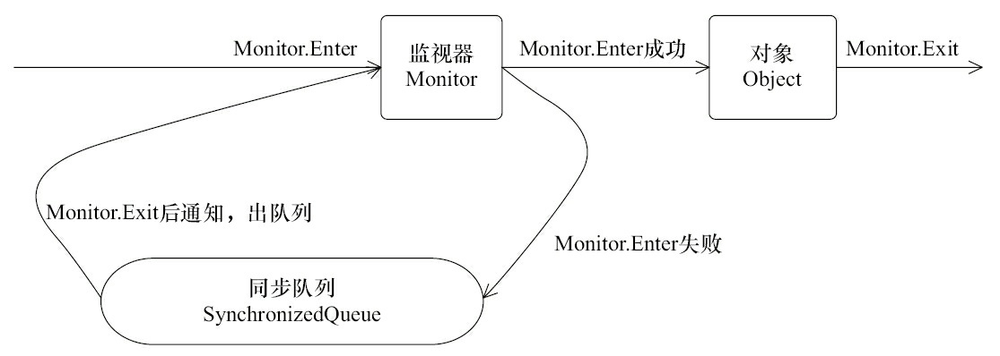

# synchronized简介
- synchronized实现同步的基础：Java中每个对象都可以作为锁。当线程试图访问同步代码时，必须先获得对象锁，退出或抛出异常时必须释放锁。

- synchronzied实现同步的表现形式分为：代码块同步 和 方法同步。

# synchronized原理
- 代码块同步：*在编译后通过将monitorenter指令插入到同步代码块的开始处，将monitorexit指令插入到方法结束处和异常处*，通过反编译字节码可以观察到。任何一个对象都有一个monitor与之关联，线程执行monitorenter指令时，会尝试获取对象对应的monitor的所有权，即尝试获得对象的锁。

- 方法同步：*synchronized方法在method_info结构有ACC_synchronized标记*，线程执行时会识别该标记，获取对应的锁，实现方法同步。

两者虽然实现细节不同，但本质上都是对一个对象的监视器（monitor）的获取。任意一个对象都拥有自己的监视器，当同步代码块或同步方法时，执行方法的线程必须先获得该对象的监视器才能进入同步块或同步方法，没有获取到监视器的线程将会被阻塞，并进入同步队列，状态变为BLOCKED。当成功获取监视器的线程释放了锁后，会唤醒阻塞在同步队列的线程，使其重新尝试对监视器的获取。



# synchronized的使用场景
## 方法同步
```java
public synchronized void method1(){

}
```
锁住的是该对象,类的其中一个实例，当该对象(仅仅是这一个对象)在不同线程中执行这个同步方法时，线程之间会形成互斥。达到同步效果，但如果不同线程同时对该类的不同对象执行这个同步方法时，则线程之间不会形成互斥，因为他们拥有的是不同的锁。

## 代码块同步
```java
synchronized(this){ 
    //TODO 
}
```

## 静态方法同步
```java
public synchronized static void method3(){

}
```
锁住的是该类，当所有该类的对象(多个对象)在不同线程中调用这个static同步方法时，线程之间会形成互斥，达到同步效果。

## 代码块同步
```java
synchronized(Test.class){ 
    //TODO
}
```
锁住的是该类，当所有该类的对象(多个对象)在不同线程中调用这个代码块同步时，线程之间会形成互斥，达到同步效果。

## 代码块同步
```java
synchronized(o) {

}
```
这里面的o可以是一个任何Object对象或数组，并不一定是它本身对象或者类，谁拥有o这个锁，谁就能够操作该块程序代码。

