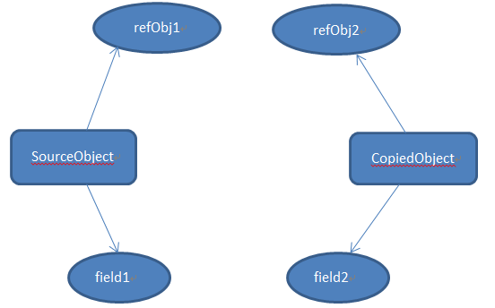

# 深拷贝
深拷贝会拷贝所有的属性,并拷贝属性指向的动态分配的内存。当对象和它所引用的对象一起拷贝时即发生深拷贝。深拷贝相比于浅拷贝速度较慢并且花销较大。



在上图中，SourceObject有一个int类型的属性 "field1"和一个引用类型属性"refObj1"（引用ContainedObject类型的对象）。当对SourceObject做深拷贝时，创建了CopiedObject，它有一个包含"field1"拷贝值的属性"field2"以及包含"refObj1"拷贝值的引用类型属性"refObj2" 。因此对SourceObject中的"refObj"所做的任何改变都不会影响到CopiedObject

# 如何实现深拷贝
```java
public class Student implements Cloneable { 
   // 对象引用 
   private Subject subj; 

   private String name; 

   public Student(String s, String sub) { 
      name = s; 
      subj = new Subject(sub); 
   } 

   public Subject getSubj() { 
      return subj; 
   } 

   public String getName() { 
      return name; 
   } 

   public void setName(String s) { 
      name = s; 
   } 

   /** 
    * 重写clone()方法 
    * 
    * @return 
    */ 
   public Object clone() { 
      // 深拷贝，创建拷贝类的一个新对象，这样就和原始对象相互独立
      Student s = new Student(name, subj.getName()); 
      return s; 
   } 
}
```

**运行结果**
```
Original Object: John - Algebra
Cloned Object: John - Algebra
Is Original Object the same with Cloned Object: false
Is Original Object's field name the same with Cloned Object: true
Is Original Object's field subj the same with Cloned Object: false
Original Object after it is updated: Dan - Physics
Cloned Object after updating original object: John - Algebra
```

很容易发现clone()方法中的一点变化。因为它是深拷贝，所以你需要创建拷贝类的一个对象。因为在Student类中有对象引用，所以需要在Student类中实现Cloneable接口并且重写clone方法。

# 通过序列化实现深拷贝
当通过序列化进行深拷贝时，必须确保对象图中所有类都是可序列化的。

注意事项：

- 确保对象图中的所有类都是可序列化的

- 创建输入输出流

- 使用这个输入输出流来创建对象输入和对象输出流

- 将你想要拷贝的对象传递给对象输出流

- 从对象输入流中读取新的对象并且转换回你所发送的对象的类

```java
public class ColoredCircle implements Serializable { 

   private int x; 
   private int y; 

   public ColoredCircle(int x, int y) { 
      this.x = x; 
      this.y = y; 
   } 

   public int getX() { 
      return x; 
   } 

   public void setX(int x) { 
      this.x = x; 
   } 

   public int getY() { 
      return y; 
   } 

   public void setY(int y) { 
      this.y = y; 
   } 

   @Override 
   public String toString() { 
      return "x=" + x + ", y=" + y; 
   } 
}
public class DeepCopy {

   public static void main(String[] args) throws IOException { 
      ObjectOutputStream oos = null; 
      ObjectInputStream ois = null; 

      try { 
         // 创建原始的可序列化对象 
         ColoredCircle c1 = new ColoredCircle(100, 100); 
         System.out.println("Original = " + c1); 

         ColoredCircle c2 = null; 

         // 通过序列化实现深拷贝 
         ByteArrayOutputStream bos = new ByteArrayOutputStream(); 
         oos = new ObjectOutputStream(bos); 
         // 序列化以及传递这个对象 
         oos.writeObject(c1); 
         oos.flush(); 
         ByteArrayInputStream bin = new        ByteArrayInputStream(bos.toByteArray()); 
         ois = new ObjectInputStream(bin); 
         // 返回新的对象 
         c2 = (ColoredCircle) ois.readObject(); 

         // 校验内容是否相同 
         System.out.println("Copied   = " + c2); 
         // 改变原始对象的内容 
         c1.setX(200); 
         c1.setY(200); 
         // 查看每一个现在的内容 
         System.out.println("Original = " + c1); 
         System.out.println("Copied   = " + c2); 
      } catch (Exception e) { 
         System.out.println("Exception in main = " + e); 
      } finally { 
         oos.close(); 
         ois.close(); 
      } 
   } 
}
​
```

**输出结果**
```
Original = x=100, y=100
Copied   = x=100, y=100
Original = x=200, y=200
Copied   = x=100, y=100
```

## 序列化这种方式有其自身的限制和问题：

因为无法序列化transient变量, 使用这种方法将无法拷贝transient变量。
再就是性能问题。创建一个socket, 序列化一个对象, 通过socket传输它, 然后反序列化它，这个过程与调用已有对象的方法相比是很慢的。所以在性能上会有天壤之别。如果性能对你的代码来说是至关重要的，建议不要使用这种方式。它比通过实现Clonable接口这种方式来进行深拷贝几乎多花100倍的时间。