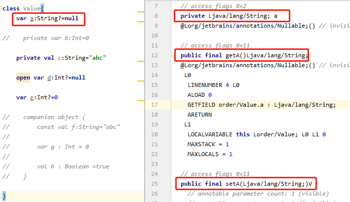
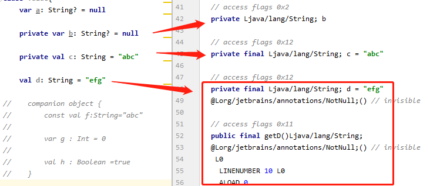
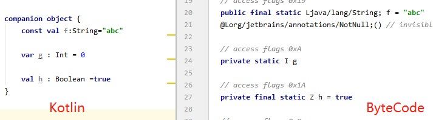

# 分析var、val

根据kotlin的字节码分析如下图：



通过字节码的分析，我们可以看出默认情况下，var编译为字节码时是private的并且同时生成get/set方法可见性为public。val默认情况下也是private，并且有个get方法没有set方法。当我们手动添加private时，则生成的var/val都是private并且没有get/set方法

# 分析count val

根据kotlin的字节码分析如下图：


通过字节码的分析，我们可以理解为在companion object中，const val 等价于Java中的静态常量。而var等价于Java中的静态变量。val等价于Java中的静态常量。其中const val为public,var和val为private。

### 注意 
- const 只能修饰val

- const 只允许在top-level级别和object中声明
```kotlin
//top-level级别
const val CONST_VAL : Int = 0

class Value{

    //object中声明
    companion object {
        const val f:String="abc"

        var g : Int = 0

        val h : Boolean =true
    }

}
```


