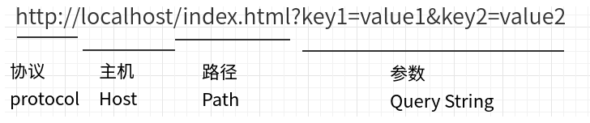

# HTTP协议
是计算机通过网络进行通信的规则，是一个基于请求与响应，无状态的，应用层的协议，常基于TCP/IP协议传输数据。目前任何终端（手机，笔记本电脑。。）之间进行任何一种通信都必须按照Http协议进行，否则无法连接。

## 四个基于：

- **请求响应：**

    客服端发送请求，服务端响应请求。

- **无状态的：**

    协议对于事务处理没有记忆能力，客户端第一次与服务器建立连接发送请求时需要进行一系列的安全认证匹配等，因此增加页面等待时间，当客户端向服务器端发送请求，服务器端响应完毕后，两者断开连接，也不保存连接状态。下一次客户端向同样的服务器发送请求时，由于他们之前已经遗忘了彼此，所以需要*重新建立连接*。 

- **应用层：**

    Http是属于应用层的协议，配合TCP/IP使用。

- **TCP/IP：**

    Http使用TCP作为它的支撑运输协议。HTTP客户机发起一个与服务器的TCP连接，一旦连接建立，浏览器（客户机）和服务器进程就可以通过套接字接口访问TCP。

*有时需要对用户之前的HTTP通信状态进行保存，比如执行一次登陆操作，在30分钟内所有的请求都不需要再次登陆。于是引入了Cookie技术。*

## HTTP请求报文

一个HTTP请求报文由请求行（request line）、请求头部（header）、空行和请求数据4个部分组成，下图给出了请求报文的一般格式。

- **请求行**

    请求行分为：请求方法、请求地址、协议版本

    - 请求方法：
        
        GET、POST、PUT、DELETE、PATCH、HEAD、OPTIONS、TRACE。
    
        最常的两种GET和POST，如果是RESTful接口的话一般会用到GET、POST、DELETE、PUT。

    - 请求地址：

        URL：统一资源定位符，是一种自愿位置的抽象唯一识别方法。

        组成：<协议>：//<主机>：<端口>/<路径>

        端口和路径有时可以省略（HTTP默认端口号是80）

        

    - 协议版本：

        协议版本的格式为：HTTP/主版本号.次版本号，常用的有HTTP/1.0和HTTP/1.1

- **请求头**

    请求头部为请求报文添加了一些附加信息，由“名/值”对组成，每行一对，名和值之间使用冒号分隔。

    常见的请求头如下：

    |请求头|说明|
    |:-|:-|
    |Host|接受请求的服务器地址，可以是IP:端口，也可以是域名|
    |User-Agent|发送请求的应用程序名称|
    |Connection|指定与连接相关的属性，如Connection:Keep-Alive|
    |Accept-Charset|通知服务端可以发送的编码格式|
    |Accept-Encoding|通知服务端可以发送的数据压缩格式|
    |Accept-Language|通知服务端可以发送的语言|

    请求头部的最后会有一个空行，表示请求头部结束，接下来为请求数据，这一行非常重要，必不可少。

- **请求数据**

    可选部分，比如GET请求就没有请求数据。

## HTTP响应报文

HTTP响应报文主要由状态行、响应头部、空行以及响应数据组成。

- **状态行**

    由3部分组成，分别为：协议版本，状态码，状态码描述。

    - 状态码：

    |状态码|说明|
    |-|-|
    |1xx|指示信息——表示请求已接收，继续处理|
    |2xx|成功——表示请求已被成功接收、理解、接受|
    |3xx|重定向——要完成请求必须进行跟进一步的操作|
    |4xx|客户端错误——请求语法错误或请求无法实现|
    |5xx|服务器端错误——服务器未能实现合法请求|

    常见状态码：
    
    |状态码|说明|
    |-|-|
    |200|响应成功|
    |202|服务器已经收到请求，但还未进行处理，会在未来再处理，通常用于异步操作。|
    |303|暂时重定向，用于POST、PUT和DELETE请求。收到303以后，浏览器不会自动跳转，而会让用户自己决定下一步怎么办。|
    |400 Bad Request|服务器不理解客户端的请求，未做任何处理。|
    |401 Unauthorized|用户未提供身份验证凭据，或者没有通过身份验证。|
    |403 Forbidden|用户通过了身份验证，但是不具有访问资源所需的权限。|
    |404 Not Found|所请求的资源不存在，或不可用。|
    |405 Method Not Allowed|用户已经通过身份验证，但是所用的 HTTP 方法不在他的权限之内。|
    |410 Gone|所请求的资源已从这个地址转移，不再可用。|
    |415 Unsupported Media Type|客户端要求的返回格式不支持。比如，API 只能返回 JSON 格式，但是客户端要求返回 XML 格式。|
    |422 Unprocessable Entity|客户端上传的附件无法处理，导致请求失败。|
    |429 Too Many Requests|客户端的请求次数超过限额。|
    |500 Internal Server Error|客户端请求有效，服务器处理时发生了意外。|
    |503 Service Unavailable|服务器无法处理请求，一般用于网站维护状态。|
    
- **响应头部**

    与请求头部类似，为响应报文添加了一些附加信息

    常见响应头部如下：

    |响应头|说明|
    |-|-|
    |Server|服务器应用程序软件的名称和版本|
    |Content-Type|响应正文的类型（是图片还是二进制字符串）|
    |Content-Length|响应正文的长度|
    |Content-Charset|响应正文使用的编码|
    |Content-Encoding|响应正文使用的数据压缩格式|
    |Content-Language|响应正文使用的语言|
    
- **响应数据**

    用于存放需要返回给客户端的数据信息。