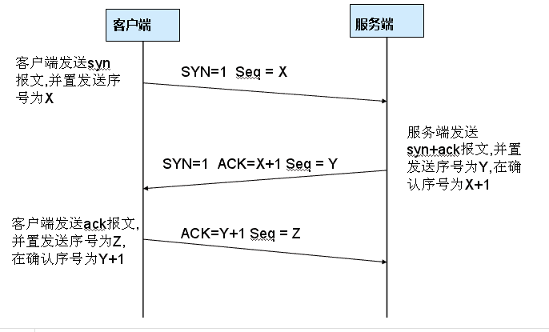
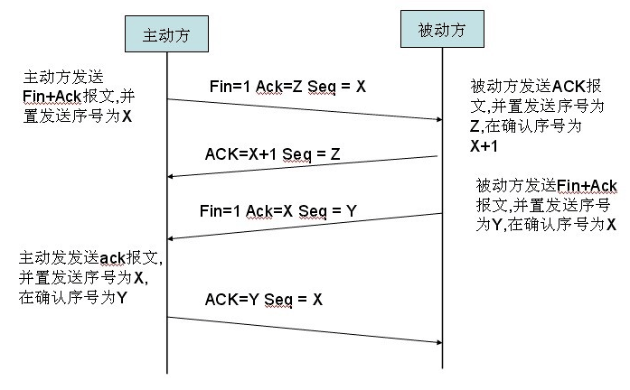

# TCP/IP模型

TCP/IP分为四个层次：数据链路层、网络层、传输层和应用层。

TCP/IP模型和OSI模型各层的对照关系。

TCP/IP协议簇按照层次由上到下，层层包装。最上面的是应用层：这里面有http,ftp等等协议。第二次传输层：TCP和UDP就在这个层次。第三层是网络层：IP协议就在这里，它负责对数据加上IP地址和其他数据以确定传输的目标。第四层是数据链路层，这个层次为带传送的数据加入一个以太网的协议头，并进行CRC编码，为最后传输做准备。

# 数据链路层

物理层负责0、1比特流与物理设备电压高低、光的闪灭之间的互换。数据链路层负责将0、1序列划分为数据帧从一个节点传输到临近的另一个节点，这些节点是通过MAC来唯一标识的(MAC，物理地址，一个主机会有一个MAC地址)。

- 封装成帧：把网络层数据报加头和尾，封装成帧，帧头中包括源MAC地址和目的MAC地址。
- 透明传输：零比特填充、转义字符。
- 可靠传输：在出错率很低的链路上很少用，但是无线链路WLAN会保证可靠传输。
- 差错检测(CRC)：接收者检测错误,如果发现差错，丢弃该帧。

# 网络层

## IP协议

IP协议是TCP/IP协议的核心，所有的TCP，UDP，ICMP，IGCP的数据都以IP数据格式传输。要注意的是，IP不是可靠的协议，这是说，IP协议没有提供一种数据未传达以后的处理机制，这被认为是上层协议——TCP或UDP要做的事情。

### IP地址
- A类IP地址：1.0.0.0~127.0.0.0
- B类IP地址：128.0.0.0~191.255.255.255
- C类IP地址：192.0.0.0~223.255.255.255

### IP协议头

TTL:某个IP数据包每穿过一个路由器，该数据包的TTL数值就会减少1，当该数据包的TTL成为零，它就会被自动抛弃。这个字段的最大值也就是255，也就是说一个协议包也就在路由器里面穿行255次就会被抛弃了，根据系统的不同，这个数字也不一样，一般是32或者是64。

## ARP及RARP协议

ARP 是根据IP地址获取MAC地址的一种协议。
ARP（地址解析）协议是一种解析协议，本来主机是完全不知道这个IP对应的是哪个主机的哪个接口，当主机要发送一个IP包的时候，会首先查一下自己的ARP高速缓存（就是一个IP-MAC地址对应表缓存）。
如果查询的IP-MAC值对不存在，那么主机就向网络发送一个ARP协议广播包，这个广播包里面就有待查询的IP地址，而直接收到这份广播的包的所有主机都会查询自己的IP地址。如果收到广播包的某一个主机发现自己符合条件，那么就准备好一个包含自己的MAC地址的ARP包传送给发送ARP广播的主机。
而广播主机拿到ARP包后会更新自己的ARP缓存（就是存放IP-MAC对应表的地方）。发送广播的主机就会用新的ARP缓存数据准备好数据链路层的的数据包发送工作。
RARP协议的工作与此相反。

## ICMP协议
IP协议并不是一个可靠的协议，它不保证数据被送达，那么，自然的，保证数据送达的工作应该由其他的模块来完成。其中一个重要的模块就是ICMP(网络控制报文)协议。ICMP不是高层协议，而是IP层的协议。
当传送IP数据包发生错误。比如主机不可达，路由不可达等等，ICMP协议将会把错误信息封包，然后传送回给主机。给主机一个处理错误的机会，这也就是为什么说建立在IP层以上的协议是可能做到安全的原因。

## TCP/UDP

| |TCP|UDP|
|:-:|:-:|:-:|
|可靠性|可靠|不可靠|
|连接线|面向连接|无连接|
|报文|面向字节流|面向报文|
|效率|传输效率低|传输效率高|
|双工性|全双工|一对一、一对多、多对一、多对多|
|流量控制|滑动窗口|无|
|拥塞控制|慢开始、拥塞避免、快重传、快恢复|无|
|传输速度|慢|快|
|应用场景|对效率要求低，对准确性要求高或者要求有连接的场景|对效率要求高，对准确性要求低|

面向报文：面向报文的传输方式是应用层交给UDP多长的报文，UDP发送多长的报文，即一次发送一个报文。因此，应用程序必须选择合适大小的报文。若报文太长，则IP层需要分片，降低效率；若太短，会使IP数据报太小。

面向字节流：面向字节流的话，虽然应用程序和TCP的交互是一次一个数据块（大小不等），但TCP把应用程序看成是一连串的无结构的字节流。TCP有一个缓冲，当应用程序传送的数据块太长，TCP就可以把它划分短一些再传送。

## DNS

DNS（Domain Name System，域名系统），因特网上作为域名和IP地址相互映射的一个分布式数据库，能够使用户更方便的访问互联网，而不用去记住能够被机器直接读取的IP数串。通过主机名，最终得到该主机名对应的IP地址的过程叫做域名解析（或主机名解析）。DNS协议运行在UDP协议之上，使用端口号53。

## TCP连接

### 三次握手

第一次握手：建立连接。客户端发送连接请求报文段，将SYN位置为1，Sequence Number为x；然后，客户端进入SYN_SEND状态，等待服务器的确认；

第二次握手：服务器收到SYN报文段。服务器收到客户端的SYN报文段，需要对这个SYN报文段进行确认，设置Acknowledgment Number为x + 1(Sequence Number + 1)；同时，自己自己还要发送SYN请求信息，将SYN位置为1，Sequence Number为y；服务器端将上述所有信息放到一个报文段（即SYN+ACK报文段）中，一并发送给客户端，此时服务器进入SYN_RECV状态；

第三次握手：客户端收到服务器的SYN+ACK报文段。然后将Acknowledgment Number设置为y + 1，向服务器发送ACK报文段，这个报文段发送完毕以后，客户端和服务器端都进入ESTABLISHED状态，完成TCP三次握手。

### 四次挥手

第一次挥手：主机1（可以是客户端，也可以是服务器端），设置Sequence Number，向主机2发送一个FIN报文段；此时，主机1进入FIN_WAIT_1状态；这表示主机1没有数据要发送给主机2了；

第二次挥手：主机2收到了主机1发送的FIN报文段，向主机1回一个ACK报文段，Acknowledgment Number为 Sequence Number+1；主机1进入FIN_WAIT_2状态；主机2告诉主机1，我“同意”你的关闭请求；

第三次挥手：主机2向主机1发送FIN报文段，请求关闭连接，同时主机2进入LAST_ACK状态；

第四次挥手：主机1收到主机2发送的FIN报文段，向主机2发送ACK报文段，然后主机1进入TIME_WAIT状态；主机2收到主机1的ACK报文段以后，就关闭连接；此时，主机1等待2MSL（MSL：Maximum Segment Lifetime，报文段最大生存时间）后依然没有收到回复，则证明Server端已正常关闭，那好，主机1也可以关闭连接了。

*MSL：报文段最大生存时间，它是任何报文段被丢弃前在网络内的最长时间。*

- *保证TCP协议的全双工连接能够可靠关闭*

- *保证这次连接的重复数据段从网络中消失*