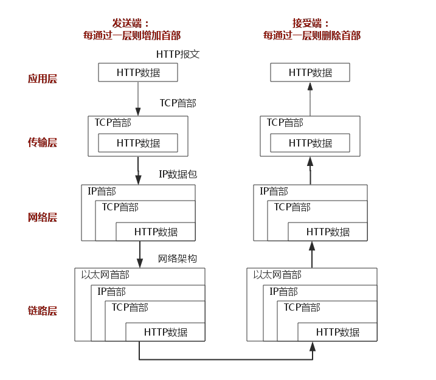

# TCP/IP模型

TCP/IP分为四个层次：数据链路层、网络层、传输层和应用层。

TCP/IP模型和OSI模型各层的对照关系。

TCP/IP协议簇按照层次由上到下，层层包装。最上面的是应用层：这里面有http,ftp等等协议。第二次传输层：TCP和UDP就在这个层次。第三层是网络层：IP协议就在这里，它负责对数据加上IP地址和其他数据以确定传输的目标。第四层是数据链路层，这个层次为带传送的数据加入一个以太网的协议头，并进行CRC编码，为最后传输做准备。

# 数据链路层

物理层负责0、1比特流与物理设备电压高低、光的闪灭之间的互换。数据链路层负责将0、1序列划分为数据帧从一个节点传输到临近的另一个节点，这些节点是通过MAC来唯一标识的(MAC，物理地址，一个主机会有一个MAC地址)。

- 封装成帧：把网络层数据报加头和尾，封装成帧，帧头中包括源MAC地址和目的MAC地址。
- 透明传输：零比特填充、转义字符。
- 可靠传输：在出错率很低的链路上很少用，但是无线链路WLAN会保证可靠传输。
- 差错检测(CRC)：接收者检测错误,如果发现差错，丢弃该帧。

# 网络层

## IP协议

IP协议是TCP/IP协议的核心，所有的TCP，UDP，ICMP，IGCP的数据都以IP数据格式传输。要注意的是，IP不是可靠的协议，这是说，IP协议没有提供一种数据未传达以后的处理机制，这被认为是上层协议——TCP或UDP要做的事情。

### IP地址
- A类IP地址：1.0.0.0~127.0.0.0
- B类IP地址：128.0.0.0~191.255.255.255
- C类IP地址：192.0.0.0~223.255.255.255

### IP协议头

TTL:某个IP数据包每穿过一个路由器，该数据包的TTL数值就会减少1，当该数据包的TTL成为零，它就会被自动抛弃。这个字段的最大值也就是255，也就是说一个协议包也就在路由器里面穿行255次就会被抛弃了，根据系统的不同，这个数字也不一样，一般是32或者是64。

## ARP及RARP协议

ARP 是根据IP地址获取MAC地址的一种协议。
ARP（地址解析）协议是一种解析协议，本来主机是完全不知道这个IP对应的是哪个主机的哪个接口，当主机要发送一个IP包的时候，会首先查一下自己的ARP高速缓存（就是一个IP-MAC地址对应表缓存）。
如果查询的IP-MAC值对不存在，那么主机就向网络发送一个ARP协议广播包，这个广播包里面就有待查询的IP地址，而直接收到这份广播的包的所有主机都会查询自己的IP地址。如果收到广播包的某一个主机发现自己符合条件，那么就准备好一个包含自己的MAC地址的ARP包传送给发送ARP广播的主机。
而广播主机拿到ARP包后会更新自己的ARP缓存（就是存放IP-MAC对应表的地方）。发送广播的主机就会用新的ARP缓存数据准备好数据链路层的的数据包发送工作。
RARP协议的工作与此相反。

## ICMP协议
IP协议并不是一个可靠的协议，它不保证数据被送达，那么，自然的，保证数据送达的工作应该由其他的模块来完成。其中一个重要的模块就是ICMP(网络控制报文)协议。ICMP不是高层协议，而是IP层的协议。
当传送IP数据包发生错误。比如主机不可达，路由不可达等等，ICMP协议将会把错误信息封包，然后传送回给主机。给主机一个处理错误的机会，这也就是为什么说建立在IP层以上的协议是可能做到安全的原因。

## TCP/UDP

